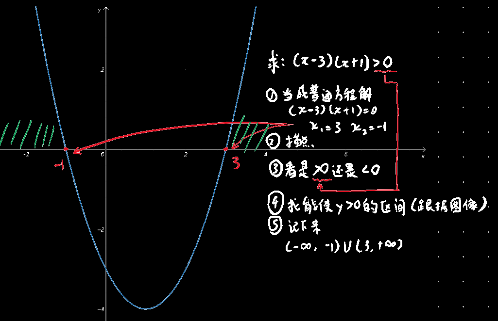

# 不等式

## 一些性质

$$
\because (a+b)^2\ge0且(a-b)^2\ge0\\
a^2+b^2\ge \pm2ab\text{等号当且仅当}a=b\text{时成立}\\
推论:a^2+b^2\ge2|a||b|
$$
$$
\because (a-b)^2\ge 0\\
a^2+b^2-2ab\ge0\\
a^2+b^2+2ab-4ab\ge 0\\
(a+b)^2\ge4ab\\
a+b\ge 2\sqrt{ab}\text{等号当且仅当}a=b\text{时成立}\\
(待确认?)a-b\ge2\sqrt{ab}\text{等号当且仅当}a=b\text{时成立}
$$
$$
|a+b|\le |a|+|b|
$$

$$
0\le |x|-x\le2|x|
$$

------

其中②可被用于ax+b+c/x的最小值（ax+b+c/x是一元二次方程标准式ax^2^+bx+c除x得到的）
$$
ax+b+\frac{c}{x}
$$
$$
=ax+\frac{c}{x}+b
$$
$$
ax+\frac{c}{x}\ge 2\sqrt{ax\cdot \frac{c}{x}}
$$
$$
ax+\frac{c}{x}\ge 2\sqrt{ac}
$$
$$
ax+b+\frac{c}{x}\ge 2\sqrt{ac}+b
$$

## 绝对值不等式

总之就是排列组合，让每个绝对值中的内容都分别有大于0和小于0的情况
$$
|x-3|+|x-5|<4
$$
$$
\text{当}x\ge 5\text{时，解得}x<6\text{，即}5\le x<6
$$
$$
\text{当}3\le x<5\text{时，解得}2<4\text{，即始终成立，即}3\le x<5
$$
$$
\text{当}x<3\text{时，解得}x>3\text{，即}2<x<3
$$

[5,6)∪[3,5)∪(2,3)=(2,6)

$$
即最终解得2<x<6
$$

## 分式不等式

$$
\frac{2x+6}{x-1}\le 0
$$
$$
\text{由上式可推出}
$$
$$
①\left( 2x+6 \right) \left( x-1 \right) \le 0
$$
$$
②x-1≠0
$$

## 一元二次不等式

注：只有最后合并是允许用并集合并的，中间计算各个情况时是要求**同时**达成各个情况，比如x>3和x<-1无法同时满足，此时要舍弃这种情况，不能看做是x∈(-∞,-1)∪(3,+∞)
$$
求：\left( x-3 \right) \left( x+1 \right) >0
$$
$$
\text{情况}①\ x-3>0\ \text{同时}x+1>0
$$
$$
x>3\ \text{同时}x>-1
$$
$$
\text{即}x>3
$$
$$
\text{情况}②\ x-3<0\ \text{同时}x+1<0
$$
$$
x<3\ \text{同时}x<-1
$$
$$
\text{即}x<-1
$$
$$
\text{综上所述}x\in \left( -\infty ,-1 \right) \cup \left( 3,+\infty \right)
$$

------

$$
\text{求：}\left( x-3 \right) \left( x+1 \right) <0
$$
$$
\text{情况}①\ x-3<0\ \text{同时}x+1>0
$$
$$
x<3\ \text{同时}x>-1
$$
$$
\text{即}-1<x<3
$$
$$
\text{情况}②\ x-3>0\ \text{同时}x+1<0
$$
$$
x>3\ \text{同时}x<-1
$$
$$
\text{无法满足上述情况，故舍弃此种情况}
$$
$$
\text{综上所述}x\in \left( -1,3 \right)
$$

---

还可以通过图像求解此问题：

