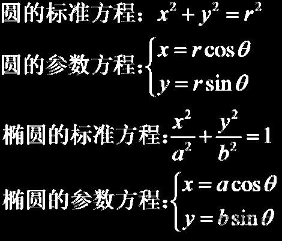

## 定义

一般地，在平面直角坐标系中，如果曲线上任意一点的坐标x、y都是某个变数t的函数：
$$
\left\{\begin{aligned}
x=r\cos \theta\\
y=r\cos \theta\\
\end{aligned}\right.
$$
并且对于t的每一个允许的取值，由方程组确定的点(x, y)都在这条曲线上，那么这个方程就叫做曲线的`参数方程`，联系变数x、y的变数t叫做`参变数`，简称`参数`。

相对而言，直接给出点坐标间关系的方程即称为普通方程。

