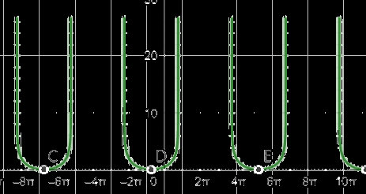

y=f(x)，x=g(z)，若f(x)与g(z)在区间上

| 两个都是增函数 | 两个都是减函数 | f(x)减函数，g(z)增函数 | f(x)增函数，g(z)减函数 |
| -------------- | -------------- | ---------------------- | ---------------------- |
| 复合函数为增   | 复合函数为增   | 复合函数为减           | 复合函数为减           |

简单的来说就是`同增异减`

例：
$$
求y=\log_{\frac12}\cos(\dfrac{x}{3}+\dfrac{\pi}{4})的增减区间\\
对数函数的定义域为(0,+\infty),因此\cos(\dfrac{x}{3}+\dfrac{\pi}{4})必须为正\\
\therefore -\dfrac{\pi}{2}+2k\pi<\dfrac{x}{3}+\dfrac{\pi}{4}<\dfrac{\pi}{2}+2k\pi,k\in Z\\
\therefore -\dfrac{9\pi}{4}+6k\pi<x<\dfrac{3\pi}{4}+6k\pi,k\in Z\\
以上为x的定义域\\
\because \log_{\frac12}(x)在x\in(0,+\infty)区间上为减函数\\
\therefore \cos(\dfrac{x}{3}+\dfrac{\pi}{4})的增区间为原函数的减区间\\
\cos(\dfrac{x}{3}+\dfrac{\pi}{4})的减区间为原函数的增区间\\
\cos(\dfrac{x}{3}+\dfrac{\pi}{4})的递减区间：[-\dfrac34\pi+6k\pi,\dfrac34\pi+6k\pi),k\in Z\\
\cos(\dfrac{x}{3}+\dfrac{\pi}{4})的递增区间：(-\dfrac94\pi+6k\pi,-\dfrac34\pi+6k\pi],k\in Z\\
\\
\therefore原函数的递增区间：[-\dfrac34\pi+6k\pi,\dfrac34\pi+6k\pi),k\in Z\\
原函数的递减区间(-\dfrac94\pi+6k\pi,-\dfrac34\pi+6k\pi],k\in Z：
$$
