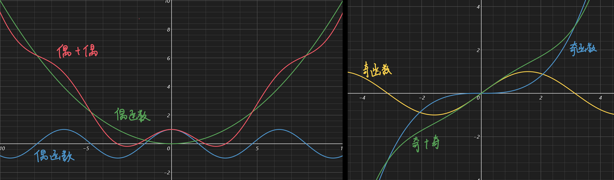
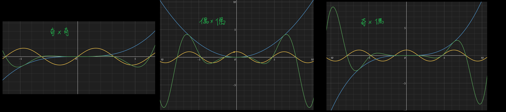
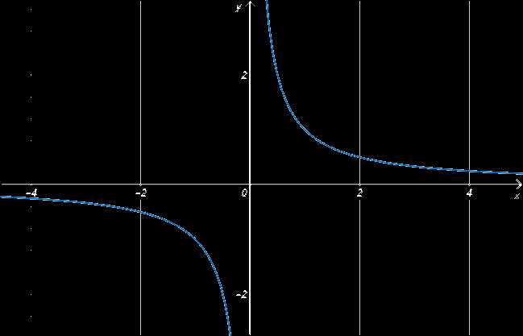
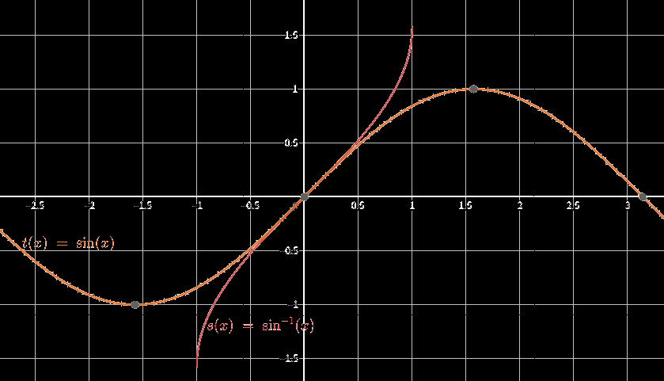

# 奇偶增减函数

## 奇偶函数

$$
f(-x)=-f(x) 奇函数，关于原点对称\\
f(-x)=f(x) 偶函数，关于y轴对称
$$

奇函数、偶函数的定义域一定关于原点对称！

------

除了使用以上那种原始定义来判断一个函数是奇是偶外，还可以使用下面这种方法。

- 验证奇函数，只需验证 $f(x)+f(-x)$ 是否为0，为0则是奇函数，否则不是;

- 验证偶函数，只需验证 $f(x)-f(-x)$ 是否为0，为0则是偶函数，否则不是。

-----

接下来，我们构造两个函数：$J(x)=f_1(x)-f_1(-x)$、$O(x)=f_2(x)+f_2(-x)$

> 构造以上两个函数用到的f(x)随意，不限定奇偶性

若使用上面那种判断方式，则可轻易证明得 $J(x)与O(x)$  的奇偶性

那么 $J(x)+J(-x)=f_1(x)-f_1(-x)+f_1(-x)-f_1(x)=0$ ，证得 $J(x)$ 是奇函数

$O(x)-O(-x)=f_2(x)+f_2(-x)-f_2(-x)-f_2(x)=0$，证得 $O(x)$ 是偶函数

如何使用这个性质来快速解题呢？

1. $y=2^x+\dfrac{1}{2^x}$ 利用如上性质可知是一个偶函数
2. $y=\ln\dfrac{1+x}{1-x}$ 利用如上性质可知是一个奇函数
3. $y=|x+3|+|x-3|$ 利用如上性质可知是一个偶函数

------

奇偶性的四则运算：

1. 奇函数 + 奇函数 = **奇函数**
2. 偶函数 + 偶函数 = **偶函数**
3. 奇函数 + 偶函数 = 非奇非偶函数

从图像上来理解也很直观（顺带一提，减法跟加法是一样的，因为给一个函数前面加个负号并不会改变它的奇偶性）

1. 奇函数 × 奇函数 = **偶函数**
2. 偶函数 × 偶函数 = **偶函数**
3. 奇函数 ×偶函数 = ==奇函数==

主要是因为正数相乘和负数相乘都是正数吧，这可以帮助奇偶函数相乘时左右都保持同号，因此是偶函数（除法与乘法同理）

## 单调增、单调减函数

单调增函数：若x~1~≤x~2~，则f(x~1~)≤f(x~2~)，或看两个不等号是否同向

单调减函数：若x~1~≤x~2~，则f(x~1~)≥f(x~2~)，或看两个不等号是否异号

严格单调增函数：若x~1~<x~2~，则f(x~1~)<f(x~2~)

严格单调减函数：若x~1~<x~2~，则f(x~1~)>f(x~2~)

对于复杂函数，一定要写在某个区间内是增函数还是减函数

如：下图函数在x<0或x>0时为单调减函数

  

## 反函数

设函数y=f(x)的定义域是D，[值域](https://baike.baidu.com/item/值域)是f(D)。如果对于值域f(D)中的每一个y，在D中有且只有一个x使得g(y)=x，则按此对应法则得到了一个定义在f(D)上的函数，并把该函数称为函数y=f(x)的**反函数**，记为x=f^-1^(y)，也就是说，函数f(x)上的一个点(a,f(a))也可用**反函数**表达为(f^-1^(f(a)),f(a))

x=f^-1^(y)与y=f(x)图像相同，是一个东西，y=f(x)描述的是x经过==一系列操作==以后能变成y，而x=f^-1^(y)描述的是**同一个y**经过==另外一系列操作==后能变回**前面的x**

而y=f^-1^(x)与y=f(x)的图像就关x轴对称了，不是一个东西，同一个x经过==不一样的一系列操作==转换成的y肯定是不一样的

------

原函数的`定义域`等于反函数的`值域`；原函数的值域等于反函数的定义域

反函数与原函数的图像==关于y=x对称==

不是所有的函数都有反函数，有反函数的充要条件是，原函数一个y只能对应一个x，（且一个x只能对应一个y，这是个函数都应该满足）

------

如y=2x → x=y/2 →y=x/2

上式中y=2x与y=x/2互为反函数

还有其实所谓的`反三角函数`其实就是普通三角函数的反函数

arcsin即为sin的反函数，因此有的地方写作sin^-1^，有的地方写arcsin，其实代表的同一个东西

