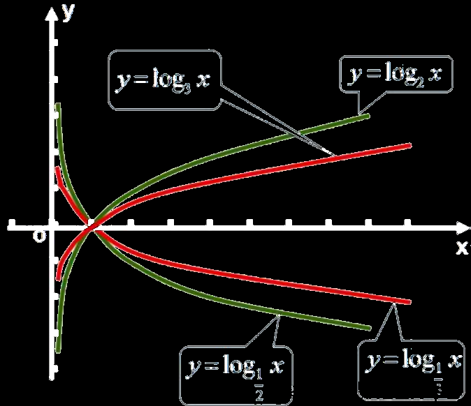
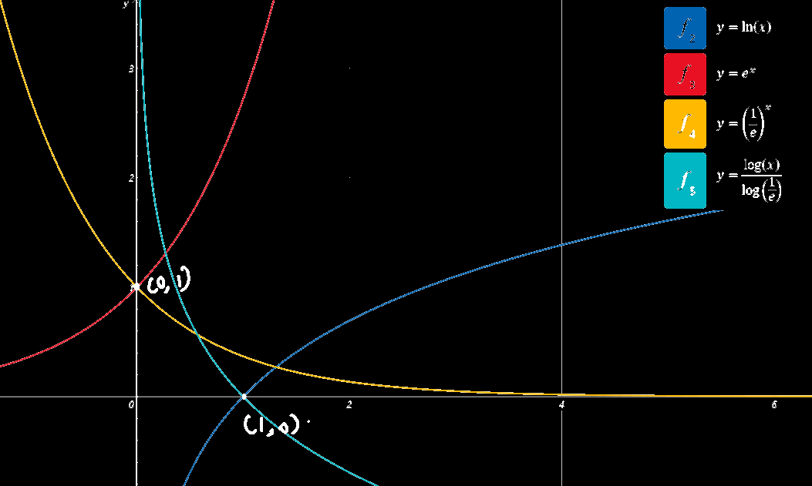

# 对数函数

## 对数函数定义

y=log~a~x  ,(x>0, a>0且a≠1) 

由于对数函数y=log~a~x与指数函数y=a^x^==互为反函数==，所以y=log~a~x的图象与的y=a^x^图象<u>关于直线y=x对称</u>, 因此，我们只要画出和y=a^x^的图象关于y=x对称的曲线，就可以得到y=log~a~x的图象，然后根据图象特征得出对数函数的性质 

  

