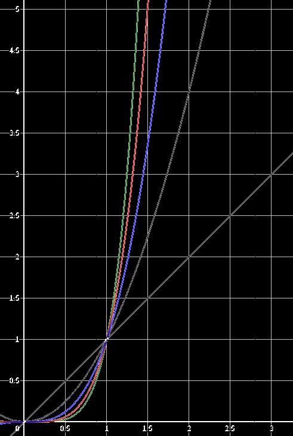
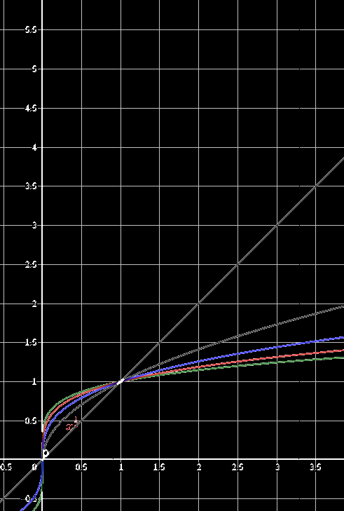
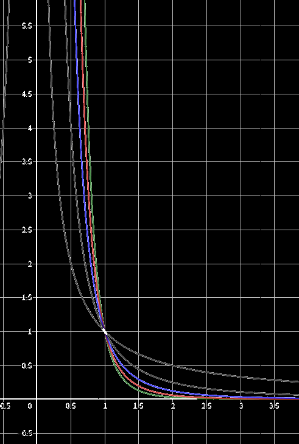
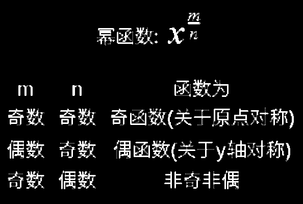

## 基本概念

幂函数的图像一定会出现在第一象限内，一定不会出现在第四象限，至于是否出现在第二、三象限内，要看函数的奇偶性；幂函数的图像最多只能同时出现在两个象限内，永远经过(1,1)

形如：y=x^a^

| 区间  | 变化趋势                        | 图像                                                         |
| ----- | ------------------------------- | ------------------------------------------------------------ |
| a>1   | a越大，从y=x越来越偏向绿线(x=1) |  |
| 0<a<1 | a越小，从y=x越来越偏向绿线(y=1) |  |
| a<0   | a越小，从y=1越来越偏向绿线(x=1) |  |

y=x^0^的图像是直线y=1==去掉一点（0,1）==。它的图像不是直线。

## 指数为分数形式 m/n

这种情况下要看 m 和 n 是奇数还是偶数了, 因为两者需要==互质==, 所以当然不会存在两者都为偶数的情况:

首先看分母为偶数, 对于这种情况只需如果考虑 x 为负数, 就明白图形只能出现在第一象限(实数域上) - 非奇非偶函数

也就是函数是奇是偶函数, 其实只需要观察分子 m 就好了: 

- 如果 m 为奇数, 函数就为奇函数;
- 如果 m 为偶数, 函数就为偶函数;