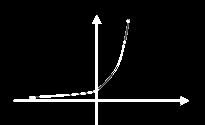
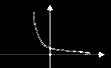

# 指数函数

## 指数函数定义

f(x)=a^x^  ==(a>0, a≠1)==

  

| 不同点： | a>1                                                          | 0<a<1                                                        |
| -------- | ------------------------------------------------------------ | ------------------------------------------------------------ |
|          |  |  |
| 单调     | 递增                                                         | 递减                                                         |
| 走势     | a越大，垂直的线越靠近y轴                                     | a越小，垂直的线越靠近y轴                                     |

| 相同点： |                                        |
| -------- | -------------------------------------- |
| 对称     | 当底数a互为==倒数==时，图像关于y轴对称 |
| 过定点   | (0,1)                                  |
| 定义域   | R                                      |
| 值域     | (0, +∞)                                |

