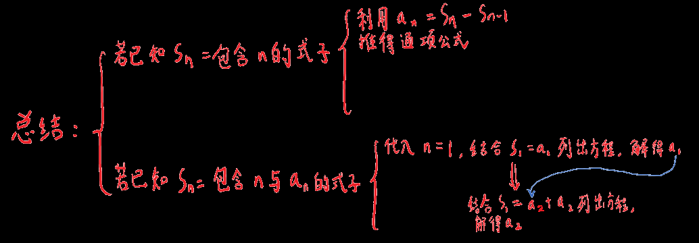

# 数列-错题汇总

## 总结

  

## 错题

1. 用一个数列的和推算另一个数列的和时，注意要求的的数列的和是否不为标准数列

   如：我以为的a~2~+a~3~+a~4~+...+a~100~

   实际上是a~2~+a~4~+a~6~+...+a~100~

2. 书写某数列通项公式或某一项的推导式时要加上(n∈N*)

3. 数列分解法：设a~n+1~=2a~n~+1

   a~n+1~+1=2a~n~+2

   a~n+1~+1=2(a~n~+1)

   令b~n~=a~n~+1

   则b~n+1~=a~n+1~+1

   则b~n+1~=2b~n~

   即把原本的不规则数列变成了等比数列

4. 遇到某些特殊的通项公式，如a~n~=-2n+11时，可能会需要求a~1~

   那么直接带进去即可a~1~=-2+11=9

5. 对于任意数列，S~1~=s~1~(当给出任意数列的和为与n有关的关系式时)

6. 对于任意数列，a~n~=S~n~-S~n-1~(n∈N*)

7. 有时不要忘了数列和本身的定义，这个可以结合前两条变成方程

   S~n~=a~1~+a~2~+...+a~n~