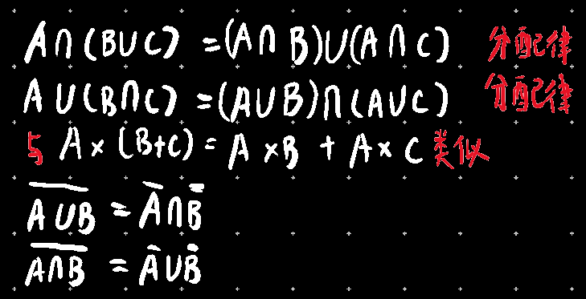

# 数列-基本

## 定义：一些==确定==的对象或事物

集合由元素构成，只要元素是确定的事物，放在一起都可以组成集合

## 书写规则

列举法：{1,3,5,7,9}

描述法：{a|1<a<9,a∈N*}

## 常用数的集合

| 符号 | 含义                            |
| ---- | ------------------------------- |
| N    | 全体自然数                      |
| Z    | 全体整数                        |
| Q    | 全体有理数                      |
| R    | 全体实数                        |
| R+   | 全体正实数                      |
| R-   | 全体负实数                      |
| R*   | 除0外的实数                     |
| ∅    | 没有元素的集合，∅包含于任何集合 |

## 子集概念

| 名称                     | 图示                                                         | 符号 |
| ------------------------ | ------------------------------------------------------------ | ---- |
| 子集，A包含于B 或 B包含A |  | A⊂B  |
| 真子集                   | /                                                            | A⊆B  |

☆如何证明两个集合相等？

若通过某种方法证明出A⊂B,B⊂A，则A=B

## 布尔运算

| 名称     | 图示                                                         | 符号                                                         |
| -------- | ------------------------------------------------------------ | ------------------------------------------------------------ |
| 并集     |  | A∪B                                                          |
|          |                                                              |                                                              |
| 交集     |  | A∩B                                                          |
| 差集     |  | A-B                                                          |
| 全集     | 就是用来表达范围大的那个东西                                 | Ω                                                            |
| 补集     |  | ∁ΩA 或  |
| 直积     |  | A×B={(a,b)\|a∈A,b∈B}，其中(a,b)为==有序==对，讲究顺序        |
| 邻域     |  | ∪(a,δ)={x \| a-δ<x<a+δ}={x \| 0≤\|x-a\|<δ}，a称为中心，δ为半径 |
| 去心邻域 |  |  |

  

