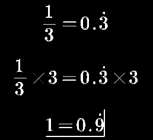
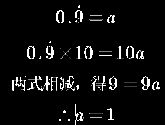
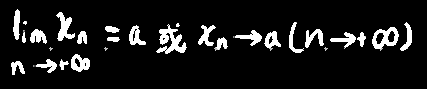

## 其余概念

数列x~1~，x~2~，...，x~n~称为无穷数列，记作{x~n~}

x~1~≤x~2~≤...≤x~n~，此时称为单调增数列

x~1~≥x~2~≥...≥x~n~，此时称为单调减数列

## 极限

引出1：

> 若有一个数列通项公式为x~n~=n/(n+1)
> 
> 写出来就是1/2 , 2/3 , 3/4 , ... , 9999/10000，写到后面发现项越发趋近于1，即极限趋近于1

引出2：

>   如何证明0.999...=1
>
>   
>
>   或：
>
>   

##### 定义：

* 任取一个任意小的邻域，总可以找到任意一个N，使N后面所有项(n>N)都落在这个邻域里面

> 对于上面的例子来说，当N=8，n>N时的所有项的值都在邻域[0.9, 1)中

* 也有一个不(显式)涉及邻域概念的定义：

对于数列{x~n~}，若存在常数`a`，任给`ε`>0，总存在`N`，使得`n`>`N`时，有|x~n~-a|<ε

> 虽然说`ε`只要大于0就行，但是太大也体现不出极限的意义，所以一般还是取0<`ε`<1

> 若存在一个`ε`，不能找到能使`n`>`N`时|x~n~-a|<ε的`N`，则该数列的极限不为`a`

>  也就是落在以`a`为中心，以`ε`为半径的邻域中

此时称数列{x~n~}以==a为极限==，或数列{x~n~}收敛于a

记作：

