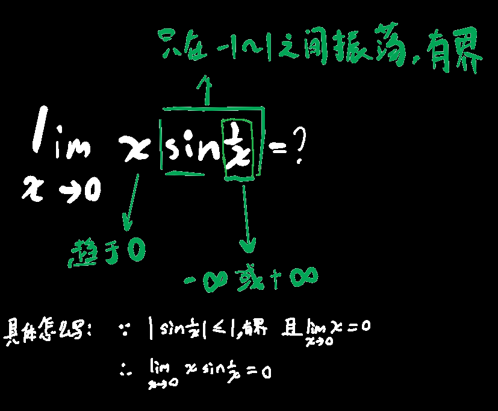

## 基本定义

函数无穷小→f(x)向0逼近

无穷大→向+∞或-∞逼近

在数列极限和函数极限的章节里，lim符号下方都写了x→什么值，下面的公式里没写，没写即代表定理在x趋近于任何情况下都成立

## 无穷小性质

1. ☆☆☆无穷小×有界数=无穷小
> 如用上述性质可证得(limx→0)(xsin(1/x))=0 
>
> 

2. 
$$
\lim f(x)=a\Leftrightarrow f(x)=a+\alpha(x),\ \lim \alpha(x)=0
$$

3. ==无穷小÷无穷小=未知==

也就是说：☆当未知数÷无穷小=常数时，未知数一定等于无穷小

## 无穷大性质

1. 两个无穷大相乘，还是无穷大（两无穷同号则正无穷，异号负无穷）

2. 无穷大+有界数=无穷大

   
(扩展思考)无穷大+无穷大=？（分多种情况，见(2)）

$$
\left\{  
             \begin{array}{**lr**}  
             +\infty+(+\infty)=+\infty\\  
             -\infty+(-\infty)=-\infty\\  
             常数\times+\infty=+\infty除非常数为0\\
             常数\times-\infty=-\infty除非常数为0\\
             +\infty+(-\infty)=+\infty、-\infty或常数（这种情况又分为多种情况，见(3)）\\
             无穷大之间相乘或相除都是不确定的
             \end{array}  
\right.
$$

$$
x\to+\infty时\\  
x+(-x)=0简单约分\\  
(x+1)+(-x)=1还是靠约分\\
x^2+(-x)=(-x)+x^2=x(-1+x)=+\infty负一加正无穷还是正无穷，相乘还是正无穷\\
x+(-x^2)=x(1-x)=-\infty正无穷乘负无穷等于负无穷，并且这个式子等于前面那个式子乘-1
$$

3. 当f(x)无穷大时，1/f(x)无穷小（前提是x必须趋近于同样的变化过程，如不能是x→-∞或x→+∞时f(x)趋近于0）
    当f(x)无穷小时，1/f(x)无穷大（前提同上）
4. 有理分式，==分母趋近于0，值则趋近于±∞==
5. 有理分式，==分母趋近于±∞，值则趋近于0==

## 更改极限符号(提供类似思路)

$$
\lim_{x\to\infty}=\lim_{ax\to\infty}=\lim_{\dfrac{x}{a}\to\infty}=\lim_{\dfrac{a}{x}\to0}\\
\lim_{x\to+\infty}=\lim_{\sqrt{x}\to+\infty}
$$

