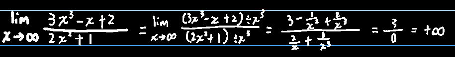
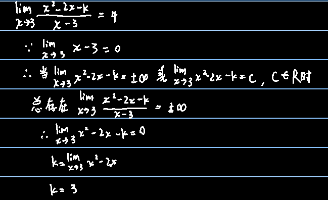

## 例1(能单纯带进去的那种)

$$
\lim_{x\to1}(2x^2-x+3)=\lim_{x\to1}(2x^2)-\lim_{x\to1}(x)+3=4\\
\lim_{x\to2}\left(\dfrac{3x-1}{x^2+6}\right)=\dfrac{\lim_{x\to2}(3x-1)}{\lim_{x\to2}(x^2+6)}=\dfrac{1}{2}
$$

这种最容易做，普通多项式趋于什么就相当于把x趋近于的那个数带进去，对于有理分式，只要是分母不趋近于0，直接带就行了

## 例2(分式趋近于无穷)

$$
\lim_{x\to2}\left(\frac{x+2}{x-2}\right)=\infty\\
\lim_{x\to \infty}\left(\dfrac{2x^2+3x+1}{5x^2+4x+3} \right)=\lim_{x\to \infty}\left(\dfrac{(2x^2+3x+1)\div x^2}{(5x^2+4x+3)\div x^2}\right)=
\lim_{x\to \infty}\left(\dfrac{2+\dfrac{3}{x}+\dfrac{1}{x^2}}{5+\dfrac{4}{x}+\dfrac{3}{x^2}}\right)=\dfrac{2}{5}\\省略了拆分几步，反正就是分母趋近无穷大，值趋近于0
$$

∴==分子分母同次且都趋于无穷，取极限的结果就是最高次系数之比==

------

$$
\lim_{x\to\infty}\left(\dfrac{5x^2+4x-1}{3x^3-2}\right)=\lim_{x\to\infty}\left(\dfrac{(5x^2+4x-1)\div x^3}{(3x^3-2) \div x^3}\right)=\lim_{x\to\infty}\left(\dfrac{5/x+4/x^2-1/x^3}{3-2/x^3}\right)=\dfrac{0}{3}=0
$$

∴==有理分式分母次数高，值趋于无穷小==

------

∴==有理分式分子次数高，值趋于无穷大==

根号可以对根号里的所有项进行一次降次

## 例3(直接带入等于0/0，且不趋近于无限时的计算)

$$
\lim_{x\to1}\dfrac{x-1}{x^2-1}=\lim_{x\to1}\dfrac{x-1}{(x-1)(x+1)}=\dfrac{1}{2}
$$

------

$$
\lim_{x\to0}\dfrac{\sqrt{1+x}-1}{x}=\lim_{x\to0}\dfrac{\sqrt{1}-1}{x}=\dfrac{0}{0}=?因此不能这么做，要分子有理化\\
=\lim_{x\to0}\dfrac{(\sqrt{1+x}-1)(\sqrt{1+x}+1)}{x(\sqrt{1+x}+1)}=\lim_{x\to0}\dfrac{x}{x(\sqrt{1+x}+1)}=\lim_{x\to0}\dfrac{1}{\sqrt{1+x}+1}=\dfrac{1}{\sqrt{1}+1}=\dfrac{1}{2}
$$

## 例4(无限项的计算)

$$
\lim_{x\to0}(\frac{1}{n^2}+\frac{2}{n^2}+\frac{3}{n^2}+\dots+\frac{n}{n^2})=\lim_{x\to0}(\dfrac{1+2+3+\dots+n}{n^2})=\lim_{x\to0}(\frac{\frac{1}{2}n(n+1)}{n^2})=\lim_{x\to0}(\frac{\frac{1}{2}(n+1)}{n})=\lim_{x\to0}(\frac{\frac{1}{2}n+\frac{1}{2}}{n})这里使用了前面有理分式的结论=\frac{1}{2}
$$

这种无限项不能拆开带进去，要想办法用公式或求和做

## 例5(根式相减——无穷减无穷)

$$
\lim_{x\to+\infty}(\sqrt{x^2+x+1}-\sqrt{x^2-x+1})正无穷减正无穷，不能直接得到结果\\
=\lim_{x\to+\infty}\left(\dfrac{x^2+x+1-(x^2-x+1)}{\sqrt{x^2+x+1}+\sqrt{x^2-x+1}}\right)\\
=\lim_{x\to+\infty}\left(\dfrac{2x}{\sqrt{x^2+x+1}+\sqrt{x^2-x+1}}\right)根号里面的二次多项式，那实际上是一次多项式\\
=\lim_{x\to+\infty}\left(\dfrac{2}{\sqrt{x^2+x+1}/x+\sqrt{x^2-x+1}/x}\right)\\
∵x>0\\
=\lim_{x\to+\infty}\left(\dfrac{2}{\sqrt{(\sqrt{x^2+x+1}/x)^2}+\sqrt{(\sqrt{x^2-x+1}/x})^2}\right)\\
=\lim_{x\to+\infty}\left(\dfrac{2}{\sqrt{(x^2+x+1)/x^2)}+\sqrt{(x^2-x+1)/x^2)}}\right)\\
=\lim_{x\to+\infty}\left(\dfrac{2}{\sqrt{1+1/x+1/x^2}+\sqrt{1-1/x-1/x^2}}\right)\\
∵x\to+∞，因此上面那些分式全是0\\
=\frac{2}{\sqrt1+\sqrt1}\\
=1
$$

若是两个根式相减，看变成==平方差==以后能不能约成常数，若可以就上下同乘平方差的另一项，这样就可以==变成有理分式==的形式，按照例2的套路计算

不过细节会不太一样，如果是按照例2的套路，则上下要同除最高次的x（根号要降次，所以对于上题中最高次为1，即同除x），那根式除x要怎么解决？

即==先平方，再开方==（前提是这个式子为正）

## 例6

