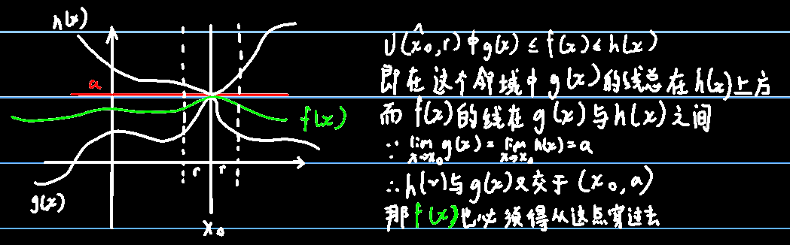
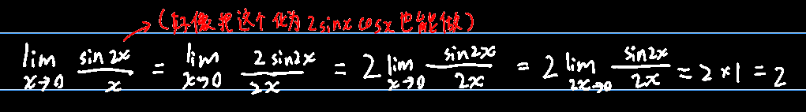
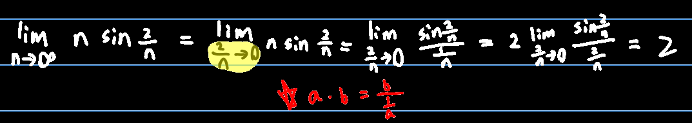
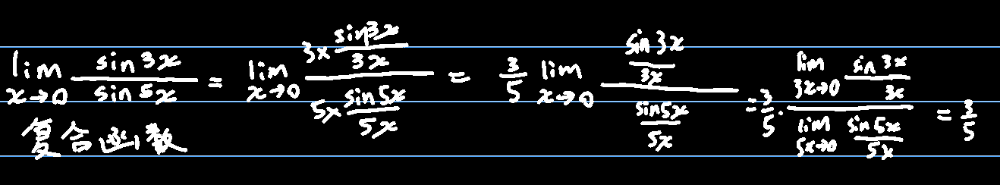
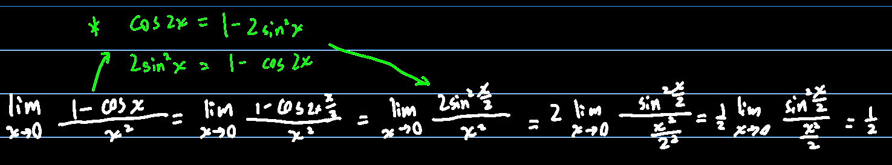
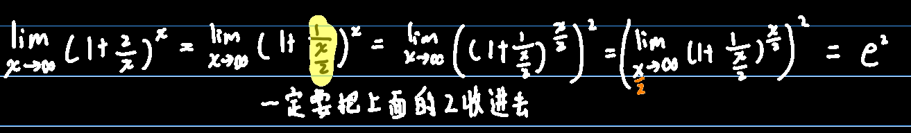
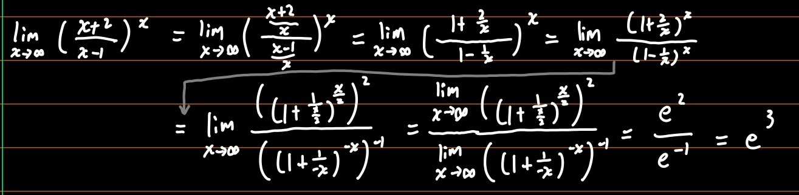
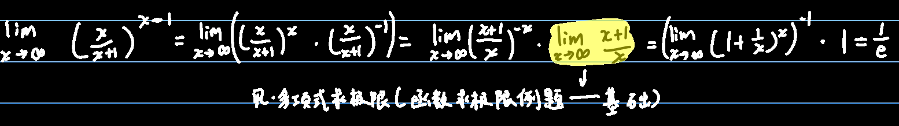
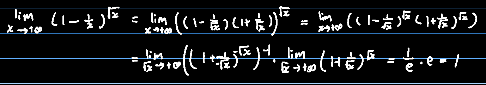

## 夹逼定理（虽然很神奇但就叫这个名字）

若存在三个函数f(x),g(x),h(x)，满足在x~0~的的去心邻域内，：
$$
g(x)\le f(x)\le h(x)\ 且\ \lim_{x\to x_0}g(x)=\lim_{x\to x_0}h(x)=a，则可推出\lim_{x\to x_0}f(x)=a
$$

$$
（x_0去心邻域写作\cup(\hat{x_0},r)帽子代表x_0是去心的）
$$

## 第一个重要极限（很重要）

$$
\lim_{x\to 0}\dfrac{\sin x}{x}=\lim_{x\to 0}\dfrac{x}{\sin x}=1\\
$$

但是实际做题过程中，经常是会要把上述的x看做一个整体，然后再利用这个性质（定理？）

1. 

（其实这题也可以把sin2x拆分为2sinx cosx）

------

并且实际做题过程中，就算求的极限不是趋近于0的，可能也会和这个定理有关

2. 

------

还有复合函数求极限：（说白了就是利用运算性质拆分）

3. 

------

4. 

还有推论：
$$
\lim_{x\to 0}\dfrac{\tan x}{x}=\lim_{x\to0}\dfrac{\sin x}{x}\dfrac{1}{\cos x}=\lim_{x\to0}\dfrac{\sin x}{x}\times\lim_{x\to0}\dfrac{1}{\cos x}=1\times1=1\\
\cos x在x为0时的值为1
$$

## 第二个重要极限

$$
\lim_{n\to\infty}(1+\dfrac{1}{n})^n=e=\lim_{n\to0}(1+n)^\dfrac{1}{n}\\
同上，做题时需要使用整体思想：\lim_{什么\to\infty}(1+\dfrac{1}{什么})^{什么}=e
$$

1. 

2. 

3. 

4. 

5. 

   总之就是平方差制根号

## 例1(极限同时小于和大于一个数则极限等于那个数)

$$
\lim_{n\to+\infty}\dfrac{2^n}{n!}=\dfrac{2\times2\times2\times\dots\times2\times2}{1\times2\times3\times\dots\times(n-1)\times n}
=\dfrac{2\times2\times2}{1\times2\times n}\times其余项=\dfrac{2\times2}{1\times n}\times其余项
$$

由于其余项那边都是一些2比上一个比2大的数，因此全部小于0，所以
$$
\lim_{n\to\infty}\dfrac{2^n}{n!}<\dfrac{4}{n}\\
∵n\to+\infty\\
∴0>\lim_{n\to\infty}\dfrac{2^n}{n!}
$$
但，又因为n是趋近于+∞的，所以
$$
0<\lim_{n\to\infty}\dfrac{2^n}{n!}
$$
综上所述，极限为0