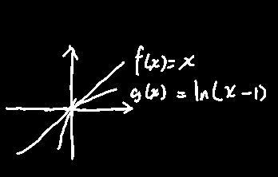
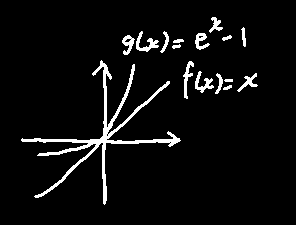
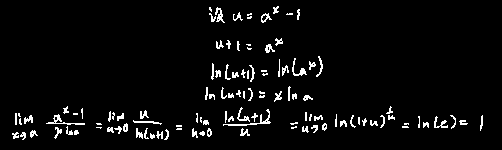
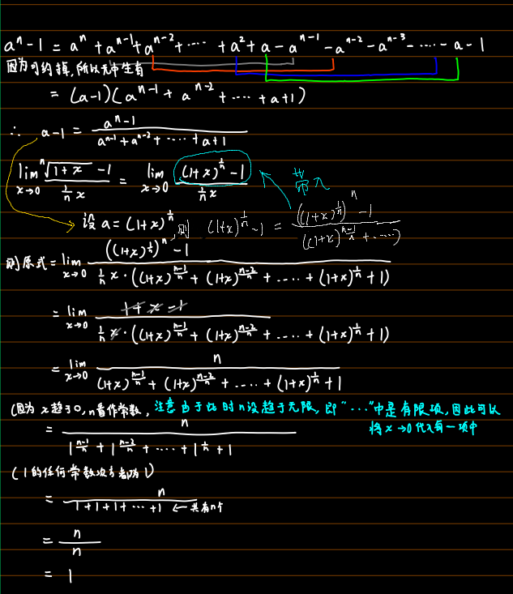

## 高阶、低阶、同阶、等价无穷小

定义：若limf(x)=0，limg(x)=0 g(x)≠0（不指定趋近于什么）
$$
若\lim\dfrac{f(x)}{g(x)}=0\ \ 则\ \ f(x)是g(x)的高阶无穷小，记作f(x)=\mathcal{O}(g(x))
$$

$$
若\lim\dfrac{f(x)}{g(x)}=\infty\ \ 则\ \ f(x)是g(x)的低阶无穷小，没符号\\
如\dfrac{x}{x^2}=\dfrac{1}{x}=+\infty
$$

$$
若\lim\dfrac{f(x)}{g(x)}=c\neq0\ \ 则\ \ f(x)是g(x)的同阶无穷小，没符号\\
如\dfrac{4x}{2x}=\dfrac{4}{2}\\
当c=1时，特别称为等价无穷小，记作f(x)\textasciitilde g(x)
$$

## 一些结论

$$
\ln(1+x)\textasciitilde x当x\to0时\\
证明（用到了《函数-函数连续性-复合函数连续性》的结论来把\lim提取到\ln里面）：\\
\lim_{x\to0}\dfrac{\ln(1+x)}{x}=\lim_{x\to0}\dfrac{1}{x}\ln(1+x)=\lim_{x\to0}\ln(1+x)^{\frac{1}{x}}=\ln e=1
$$

图形化理解：

------

$$
e^x-1\textasciitilde x（可记忆为e^x-1\textasciitilde x\ln e）当x\to 0时\\
证明：\\
令u=e^x-1\\
e^x=u+1\\
\ln(e^x)=\ln(u+1)\\
x=\ln(u+1)\\
\lim_{x\to0}\dfrac{e^x-1}{x}=\lim_{\ln(u+1)\to0}\dfrac{u}{\ln(u+1)}=\lim_{u\to0}\dfrac{u}{\ln(u+1)}=\left(\lim_{u\to0}\dfrac{\ln(u+1)}{u}\right)^{-1}=1（引用了上一个结论）
$$

图形化理解：

------

$$
a^x-1\textasciitilde x\ln a\\
证明：\\
$$

------

$$
\sqrt[n]{1+x}-1\ \textasciitilde\ \dfrac{1}{n}x
$$

------

$$
还有重要极限中的结论也可用于这边\\
\sin x\textasciitilde x\\

tan x\textasciitilde x
$$

## 以上结论有什么用：无穷小替换

$$
若f_1(x)\textasciitilde f_2(x),g_1(x)\textasciitilde g_2(x)，且\lim\dfrac{f_2(x)}{g_2(x)}存在\\
则\lim\dfrac{f_1(x)}{g_1(x)}=\lim\dfrac{f_2(x)}{g_2(x)}=\lim\dfrac{f_1(x)}{g_2(x)}=\lim\dfrac{f_2(x)}{g_1(x)}
$$

注意：

1. 两个无穷小==之比==才能用替换，~~lim(f~1~(x)+g~1~(x))=lim(f~2~(x)+g~2~(x))~~

2. 分子或分母是因子的乘积，选==部分==进行替换

例1：
$$
\lim_{x\to 0}\dfrac{\sin 2x}{x^3+3x}=\lim_{x\to 0}\dfrac{2x}{x^3+3x}=\dfrac{2}{3}
$$
例2：
$$
\lim_{x\to 0}\dfrac{(e^x-1)\sin x}{1-\cos x}=\lim_{x\to 0}\dfrac{(e^x-1)\sin x}{2\sin^2\dfrac{x}{2}}=\lim_{x\to 0}\dfrac{x\cdot x}{2\cdot\dfrac{x^2}{4}}=\lim_{x\to 0}\dfrac{x^2}{\dfrac{1}{2}x^2}=2
$$
例3：
$$
\lim_{x\to0}\dfrac{x-\sin x}{x^2\sin x}=严格地讲有隐藏的这一步\left(\lim_{x\to0}\dfrac{\dfrac{1}{x^2}(x-\sin x)}{\sin x }\right)=\lim_{x\to0}\dfrac{x-\sin x}{x^2\times x}\\
问：分子中的\sin x能不能替换为x啊？\\
答：不行！无穷小替换只能在分式中进行，如果是因式还可以强行把其中的一部分挪到分子或分母上，达成替换的标准格式\\
多项式就没法拆开然后挪动了
$$
