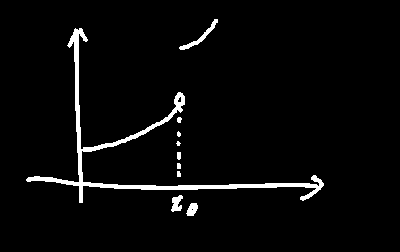
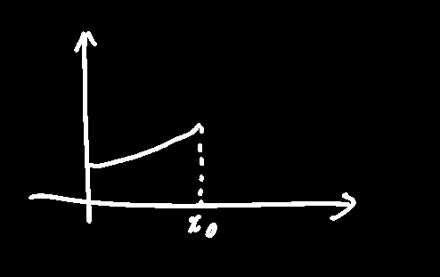

## 函数在某点连续定义

如果全部满足如下条件：

1. f(x)在x~0~处有定义
2. 当x→x~0~时，f(x)有极限
3. 当x→x~0~时，f(x)的极限为f(x~0~)

则可证得f(x)在x~0~(常数)上是连续的，标准表达：
$$
\lim_{x\to x_0}f(x)=\lim_{x\to x_0^-}f(x)=\lim_{x\to x_0^+}f(x)=f(x_0)\\
或\lim_{\triangle x\to0}\triangle y=\lim_{\triangle x\to0}(f(x_0+\triangle x)-f(x_0))=0
$$

> 如下函数在x~0~处不连续
> 
> 

## 函数在某点左连续定义

下图中的函数在x~0~处左连续

~~在(x~0~-δ,x~0~]~~
$$
左连续：\lim_{x\to x_0^-}f(x)=f(x_0)\\
右连续：\lim_{x\to x_0^+}f(x)=f(x_0)\\
$$
在x~0~处连续的 充要条件是 既是左连续又是右连续

## 函数在闭区间[a,b]内连续

先证明(a,b)内所有点都符合连续的定义（左极限等于右极限等于函数值），然后证明左端点的右极限等于函数值，右端点的左极限等于函数值

> 因此闭区间的两个端点不严格地符合连续定义？因为只要求左或右极限符合函数值就行