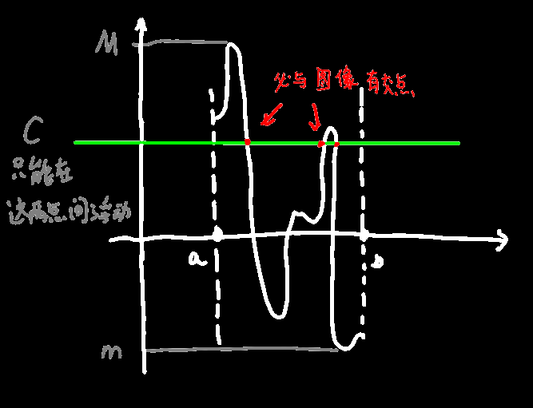
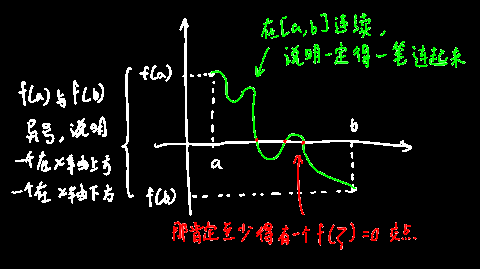

## 连续函数运算

如果f(x)与g(x)都在某处连续，则f(x)与g(x)相加相减相乘相除依然连续

任意多项式函数f(x)是连续的，f(x)=a~0~x^n^+a~1~x^n-1^+a~2~x^n-1^+...+a~n-1~x+a~n~

任意(分母不为0)分式函数f(x)是连续的，f(x)=多项式/多项式

------

☆复合函数带入：

假设u=φ(x)和y=f(u)在x~0~处是连续的，则lim~x→x0~f(φ(x)) = f(lim~x→x0~φ(x))

若y=f(x)是连续的，并且单调增或单调减，则`反函数`也是连续的，单调增或单调减

------

☆初等函数连续性：

初等函数都是连续的

> 初等函数（基本函數）是由常函数、幂函数、指数函数、对数函数、三角函数和反三角函数等经过有限次的有理运算（加、减、乘、除、有限次乘方、有限次开方）及有限次函数复合所产生、并且在定义域上能用一个方程式表示的函数。 一般来说，分段函数不是初等函数，因为在这些分段函数的定义域上不能用一个解析式表示。

------

☆底数与指数带入函数极限值：

lim u(x)=a，lim v(x)=b则lim u(x)^v(x)^=a^b^，这个定理其实没有看起来的那么好证，实际上是依赖复合函数的运算方法来推得的
$$
\lim u(x)^{v(x)}=\lim e^{\ln u(x)^{v(x)}}=\lim e^{v(x)\ln(u(x))}=e^{\lim (v(x)\ln(u(x)))}=e^{\lim v(x)\cdot\lim(\ln(u(x)))}\\
=e^{\lim v(x)\cdot\ln(\lim u(x))}=e^{b\cdot\ln a}=e^{\ln a^b}=a^b
$$

## 闭区间(方括号区间)上连续性质

#### 有界性：

函数f(x)在[a,b]上是连续的，则在这个区间中一定有界

因为(包括端点)所有点都是连续的，因此所有点都不能是无限，而且连续的函数又要能“一笔画出来”，因此，额，至少看起来一定要有界

#### 最值性(感觉像废话)：

函数f(x)在[a,b]上是连续的，则在这个区间中一定有最大值和最小值

#### 介值性(也是废话)：

函数f(x)在[a,b]上是连续的，最大值为M，最小值为m，对于c，m<c<M，必存在ζ，使得f(ζ)=c

### ☆零点存在定理：

函数f(x)在[a,b]上是连续的，f(a) · f(b)<0，（说明f(a)与f(b)异号）

则在(a,b)内一定至少存在一点ζ，使得f(ζ)=0

