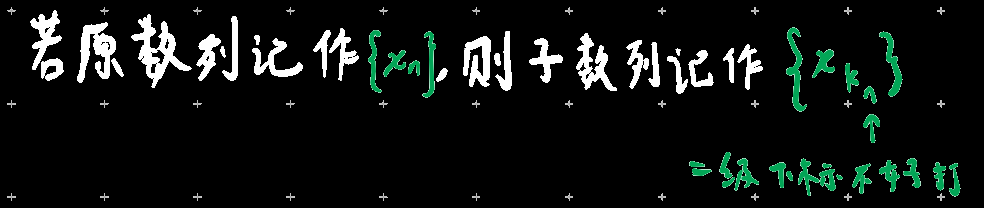

### 性质1

{x~n~}收敛，极限唯一

### 性质2

{x~n~}收敛，则{x~n~}一定有界

（此时有界是收敛的必要条件）

### 性质3

在单调的情况下，有界是收敛的充要条件（单调有限，必有极限）

单调增有上界，必有极限

单调减有下界，必有极限

### 性质4

> 子数列中的所有元素属于原数列且元素**顺序**等于原数列，
>
> 只是抽掉了其中一部分元素，

{x~n~}收敛于a，则任意子数列{x~kn~}收敛于a

> 推论1：若找到一个子数列不收敛，则原数列不收敛（即发散）
>
> 推论2：若找到两个子数列收敛，但极限不同，则原数列不收敛（即发散）
>
> > 如原数列为1,-1,1,-1,1,-1...显然不收敛
> >
> > 但是有两个子数列1,1,1,1...和-1,-1,-1,-1...是收敛的
>
> 推论3：原数列收敛←→奇数项、偶数项构成的数列也收敛且极限相同