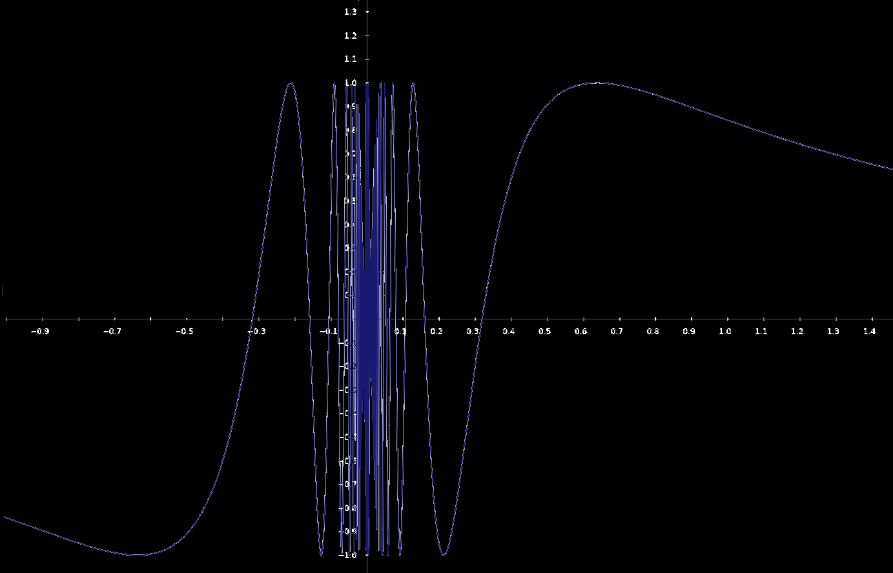

## 函数的间断点定义

1. f(x)在x~0~处有定义
2. 当x→x~0~时，f(x)有极限
3. 当x→x~0~时，f(x)的极限为x~0~

上述三条有一条==不满足==，则x~0~处是间断点

------

### 间断点分类：

1. #### 无穷间断点

如：f(x)=1/x，x=0为f(x)的无穷间断点

在x=0时值为无穷，没有定义

2. #### 震荡间断点

如(应有大括号联立但不好打)：

f(x)=sin(1/x),	x≠0

  =0,	x=0

在x趋于0时没有极限（首先看着就没极限，具体证明在《函数-函数极限性质-性质4》）

但在x=0时有定义，因为写在联立里了，如果联立里没写则不仅没极限也没定义

它越靠近y轴，波越密集，震荡得越快

3. #### 跳跃间断点

例子懒得举了，就是那种分段函数

4. #### 可去间断点

就是在x~0~处额外定义了它的值

显然，它在x~0~处是有定义的，也有极限（在x~0~的去心邻域内有定义就行，函数极限不是数的极限，具体见《函数-函数极限-情况4》）

只是极限值不等于

------

### 另类间断点分类：

1. #### 第一类间断点

即左右极限均存在的间断点（但没说左右极限均相等），`可去间断点`和`跳跃间断点`都属于第一类间断点

2. #### 第二类间断点

左右极限不存在，`无穷间断点`和`震荡间断点`都属于第二类间断点