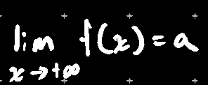
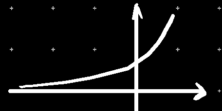
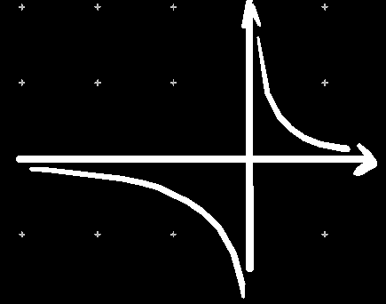
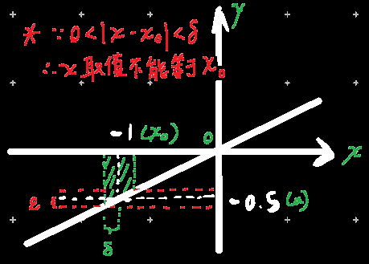
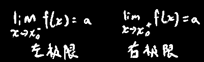

# 函数极限

## 定义

### 情况1：x→+∞时f(x)→a

> 即证明，若对于f(x)，存在常数a（==a为极限==），任给ε>0，则存在X，在x>X时，|f(x)-a|<ε
>
> 记作
>
> 如：
>
> 

### 情况2：x→-∞时f(x)→a

> 即证明，若对于f(x)，存在常数a（a为极限），任给ε>0，则存在X(X>0)，在x<-X时，|f(x)-a|<ε
>
> 如：
>
> 

### 情况3：x→∞时f(x)→a

> 即证明，若对于f(x)，存在常数a（a为极限），任给ε>0，总存在X(X>0)，在|x|>X时，|f(x)-a|<ε
>
> 如：
>
> 

### 情况4：x→x~0~但不等于x~0~时f(x)→a

> 假设f(x)在x~0~的去心邻域内有定义（在x~0~处可以没有定义），若存在常数a（a为极限），任给ε>0，总存在δ>0，在0<|x-x~0~|＜δ时|f(x)-a|<ε
>
> 如：
>
> 

>又如：
> 
>

> 求极限看起来很容易，并且像听君一席话如听一席话，把趋于的值带进去就行了，但是证明比较麻烦

左极限：x→x~0~^-^，若存在常数a，任给ε>0，总存在δ>0，在0<x~0~-x＜δ

右极限：x→x~0~^+^，若存在常数a，任给ε>0，总存在δ>0，在0<x-x~0~＜δ

定理1：
$$
\lim_{x\rightarrow x_0}f\left( x \right) =a\Longleftrightarrow \lim_{x\rightarrow x_{0}^{-}}f\left( x \right) =\lim_{x\rightarrow x_{0}^{+}}f\left( x \right) =a
$$
换而言之，只要证明左极限==或==右极限不存在，则原本的极限不存在

或证明左右不等，则原来的极限也不存在

