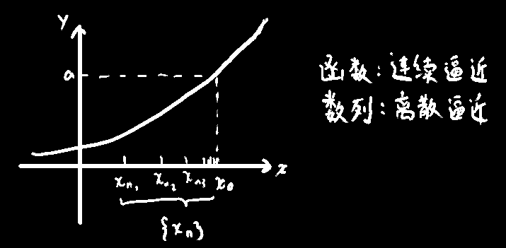
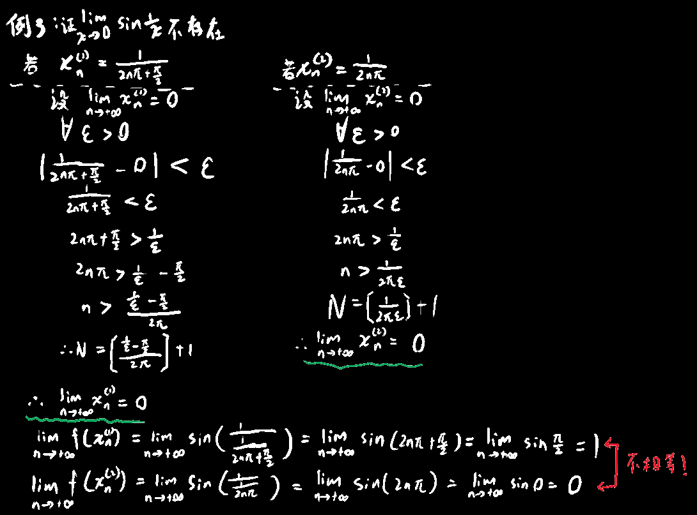

## 函数极限性质

### 性质1：

如果极限存在，那它一定是唯一的

### 性质2：

(局部有限性)若极限存在，则一定存在一个x~0~的去心邻域，在这个邻域中f(x)是有界的

### 性质3：

(局部保号性)若limf(x)→a，a>0，极限是个正的，则一定存在去心邻域，使得在去心邻域中f(x)>0

### 性质4：

$$
\lim_{x\rightarrow x_0}f\left( x \right) =a\Longleftrightarrow x\rightarrow x_0\text{时任意取一个数列}\left\{ x_n \right\} \text{，当}\lim_{n\rightarrow \infty}x_n=x_0\text{时}\lim_{n\rightarrow \infty}f\left( x_n \right) =a
$$

不过性质4直接使用的机会比较少，用的多的是它的逆否命题

即①当一个f(x~n~)的极限不存在时，f(x)的极限也不存在

②当两个存在极限的f(x~n~)极限不等时，f(x)的极限也不存在

> 怎么用？
>
> 

