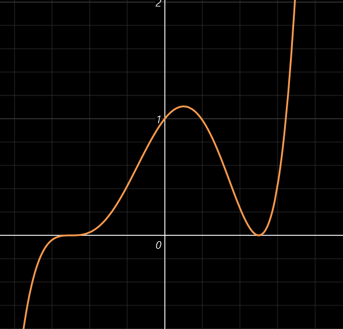

## 极值点(局部的概念)

> 注： $U(x_0)指x_0附近的小邻域$

$$
极大值定义：假设有U(x_0),\forall x\in U(\hat{x_0})，都有f(x)<f(x_0)，则称f(x_0)称为极大值，x_0为极大值点\\
那个小帽子是指不包括x_0\\
极小值定义：假设有U(x_0),\forall x\in U(\hat{x_0})，都有f(x)>f(x_0)，则称f(x_0)称为极小值，x_0为极小值点\\
$$

------

#### 定理1~（其实就是费马引理，见《微分-中值定理-费马引理》）~：

$$
f(x)在x_0可导，且在x_0取极值，则f'(x_0)=0
$$
由于 $f'(x)=0$被称为驻点，因此==可导函数的==极值点一定是驻点，但是驻点的不一定是极值点（如y=x^3^,x=0）

此外，导数不存在的点也可能是极值点，因为极值点**本身的定义不包括此点可导**，只要比其它点大/小就行

综上所述：==极值点一定是驻点或导数不存在的点==，但若想反过来说，则要再加个条件：见下方

------

#### 定理2：

$$
f(x)在(x_0-\delta,x_0+\delta)内连续且可导(x_0点可除外)\\
且f'(x_0)=0或不存在\\
1)若左增右减，则为极大值\\
数学表达:(x\in(x_0-\delta,x_0)时f'(x)>0,x\in(x_0,x_0+\delta)时f'(x)<0)\\
2)若左减右增，则为极小值\\
数学表达:(x\in(x_0-\delta,x_0)时f'(x)<0,x\in(x_0,x_0+\delta)时f'(x)>0)\\
3)左右都增/左右都减，则不是极值\\
数学表达:x\in(\hat{x_0},f'(x)不变号)\\
$$
#### 定理3：

$$
若x_0处有二阶导，f'(x_0)=0，f''(x_0)\neq0\\
1)若f''(x_0)<0，则说明该点是极大值点\\
2)若f''(x_0)>0，则说明该点是极小值点\\
证:\\
设f''(x_0)<0,f'(x_0)=0\\
\because f''(x_0)=\lim_{x\to x_0}\dfrac{f'(x)-f'(x_0)}{x-x_0}\\
\because f''(x_0)<0且f'(x_0)=0\\
\therefore \lim_{x\to x_0}\dfrac{f'(x)}{x-x_0}<0\\
当x\in(x_0-\delta,x_0)时x-x_0<0\\
因此f'(x)>0\\
当x\in(x_0+\delta,x_0)时x-x_0>0\\
因此f'(x)<0\\
左增右减，即为极大值，图形理解也很方便:
$$

------

$$
一条曲线横跨x轴，那都既然是横跨了，肯定横跨的前后线段一段在x轴上方，一段在x轴下方\\
即总有一部分>0，一部分<0，结合f'(x_0)=0，那x_0点肯定是极值点\\
至于是最大值还是最小值，那要看二阶导的正负性\\
\\
二阶导在x_0处大于0时说明一阶导函数要像上图一样经过x轴，如果是那样经过\\
那必然左边f'(x)大于0，右边f'(x)小于0，是极大值\\
\\
二阶导在x_0处小于0时会像下图那样\\
左边f'(x)小于0，右边f'(x)大于0，是极小值\\
$$

$$
另外，刚才有说f''(x_0)不准为0，那如果为0会变成下述的三种情况，不好确定很麻烦，因此不做讨论
$$

## 因此求极值步骤如下：

1. 求定义域
2. 求导
3. 找导数=0(设刚才求出来的导函数值为0然后解方程)和导数不存在的点
4. 看f'(x)取上述点的左右邻域的符号
5. 带入函数值

#### 例1： 

求 $y=(x-1)^2(x+1)^3$ 的极值点：
$$
定义域为R，f'(x)=2(x-1)(x+1)^3+3(x-1)^2(x+1)^2\\
=(x+1)^2(2(x-1)(x+1)+3(x-1)^2)\\
=(x+1)^2(2x^2-2+3x^2-6x+3)\\
=(x+1)^2(5x^2-6x+1)\\
=(x+1)^2(x-1)(5x-1)\\
设(x+1)^2(x-1)(5x-1)=0\\
则x_0=1,x_1=-1,x_2=\dfrac15\\
$$

| x     | $(-\infty,-1)$                                   | -1                     | $(-1,\dfrac15)$  | $\dfrac15$ | $(\dfrac15,1)$   | 1        | $(1,+\infty)$    |
| ----- | ------------------------------------------------ | ---------------------- | ---------------- | ---------- | ---------------- | -------- | ---------------- |
| f'(x) | >0 （此时(x+1)^2^>0, (x-1)<0, (5x-1)<0，正负负） | 0                      | >0（此时正负负） | 0          | <0（此时正负正） | 0        | >0（此时正正正） |
|       | 递增                                             | 非极值点(左右导数同号) | 递增             | 极大值点   | 递减             | 极小值点 | 递增             |

------

#### 例2：

求 $y=x-\dfrac32 x^{\frac23}$ 的极值点：
$$
x^{\frac23}，上偶下奇，是偶函数。定义域为R\\
f'(x)=1-\frac32\times\dfrac23\times x^{-\frac13}
=1-\dfrac{1}{x^3}\\
因此在x=0时，导数不存在\\
另设1-\dfrac{1}{x^3}=0\\
\dfrac{1}{x^3}=1\\
x^3=1\\
x=1\\
\therefore x=1为驻点
$$

| x     | $(-\infty,0)$ | 0      | (0,1) | 1      | $(1,+\infty)$ |
| ----- | ------------- | ------ | ----- | ------ | ------------- |
| f'(x) | >0            | 不存在 | <0    | =0     | >0            |
|       | 递增          | 极大值 | 递减  | 极小值 | 递增          |

------

#### 例3：

求 $f(x)=(x^2-1)^3+1$ 的极值点：
$$
f'(x) = 6x(x^2-1)^2,f''(x)=6(x^2-1)(5x^2-1)\\
因此x_0=0,x_1=1,x_2=-1都是此f(x)的驻点\\
当x=0时，f''(x)>0，是极小值\\
当x=-1时，f''(x)=0，无法直接判断\\
因此计算得x\in(-\infty,-1)时f'(x)<0;x\in(-1,0)时f'(x)<0;故不存在极值\\
因此计算得x\in(1,+\infty)时f'(x)>0;x\in(-1,0)时f'(x)>0;故不存在极值\\
$$
