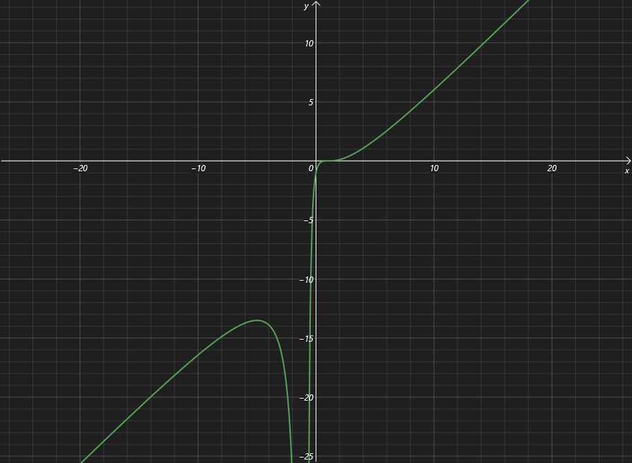

简单来说就是：找图像的特征点（拐点等）处的函数值，然后根据特征点之间的增减性、凹凸性，手动把函数补全

------

具体步骤：

1. 找定义域
2. 找不连续的点（一般都是分母=0/根号小于0的点）
3. 算与x轴和y轴的交点
4. 奇偶性与周期性，如果有的话只用画一部分就行
5. 找一阶导与二阶导==等于零==或==不存在==的点
6. 找极值点 / 驻点 / 拐点
7. 找渐近线（垂直 / 水平 / 斜）；
8. 计算极值点间的凸凹性 / 增减性

## 例1：$y=\dfrac{(x-1)^3}{(x+1)^2}$

1. 定义域：分母不能取-1，因此 $(-\infty,-1)\cup(-1,+\infty)$ ，也由此可知x=-1是此函数的无穷间断点，也是此函数的垂直渐近线

2. 交点：$(0,-1),(1,0)$

3. 显然没有奇偶性或垂直性

4. $a=\lim_{x\to\infty} \dfrac{f(x)}{x}=1\\b=\lim_{x\to\infty}(f(x)-ax)=-5$，斜渐近线为$y=x-5$

5. $f'(x)=\dfrac{(x-1)^2(x+5)}{(x+1)^3}$, $f''(x)=\dfrac{24(x-1)}{(x+1)^4}$

   x=-1时y'与y''都不存在，设 $f'(x)=0$解得$x_0=1,x_1=-5$，设 $f''(x)=0$ 解得 $x=1$

| $x$      | $(-\infty,-5)$ | $-5$   | $(-5,-1)$  | $-1$       | $(-1,1)$   | $1$  | $(1,+\infty)$ |
| -------- | -------------- | ------ | ---------- | ---------- | ---------- | ---- | ------------- |
| $f'(x)$  | 正             | 0      | 负         | 不存在     | 正         | 0    | 正            |
| $f''(x)$ | 负             | 负     | 负         | 不存在     | 负         | 0    | 正            |
| $f'(x)$  | 单调增，凸     | 极大值 | 单调减，凸 | 无穷间断点 | 单调增，凸 | 拐点 | 单调增，凹    |

