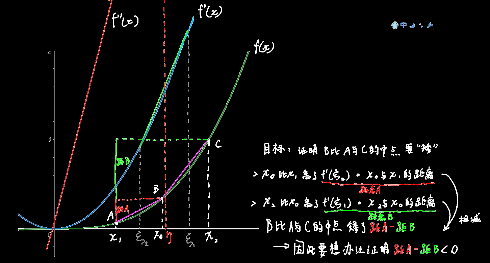

证明f''(x)>0时为凹函数（拉格朗日中值定理）：
$$
设f''(x)>0,任取x_1与x_2，假设x_1<x_2,且设x_0=\dfrac{x_1+x_2}{2}\\
因此我们的目标是：证明\dfrac{f(x_1)+f(x_2)}{2}>f(x_0)（标准凹函数定义）\\
即证明：2f(x_0)-(f(x_1)+f(x_2))<0\\
$$

$$
由假设可知在[x_1,x_0]区间内，有f'(\xi_2)=\dfrac{f(x_0)-f(x_1)}{x_0-x_1}\\
即①f(x_0)-f(x_1)=f'(\xi_2)(x_0-x_1)\\
由假设可知在[x_0,x_2]区间内，有f'(\xi_1)=\dfrac{f(x_2)-f(x_0)}{x_2-x_0}\\
即②f(x_2)-f(x_0)=f'(\xi_1)(x_2-x_0)\\
①-②可得\\
2f(x_0)-(f(x_1)+f(x_2))=f'(\xi_2)(x_0-x_1)-f'(\xi_1)(x_2-x_0)\\
$$

下面是个简单的图形解释

$$
\because x_0=\dfrac{x_1+x_2}{2}\\
\therefore x_0-x_1=x_2-x_0=\dfrac{x_2-x_1}{2}\\
2f(x_0)-(f(x_1)+f(x_2))=\dfrac{x_2-x_1}{2}(f'(\xi_2)-f'(\xi_1))\\
对上式再次使用拉格朗日中值定理：\\
既然f'(\xi)=\dfrac{f(b)-f(a)}{b-a}\\
则f''(\xi)=\dfrac{f'(b)-f'(a)}{b-a}\\
则设在[\xi_2,\xi_1]区间内，有f''(\eta)=\dfrac{f'(\xi_2)-f'(\xi_1)}{\xi_2-\xi_1}\\
2f(x_0)-(f(x_1)+f(x_2))=\dfrac{x_2-x_1}{2}f''(\eta)(\xi_2-\xi_1)\\
$$

$$
说了x_2>x_1,因此\dfrac{x_2-x_1}{2}>0\\
说了f''(x)在[x_1,x_2]内>0,\eta又在[x_1,x_2]内,因此f''(\eta)>0\\
\xi_2在\xi_1后头，因此\xi_2-\xi_1<0\\
综上所述,\dfrac{x_2-x_1}{2}f''(\eta)(\xi_2-\xi_1)<0\\
即f(x_0)<\dfrac{f(x_1)+f(x_2)}{2}\\
为凹函数
$$