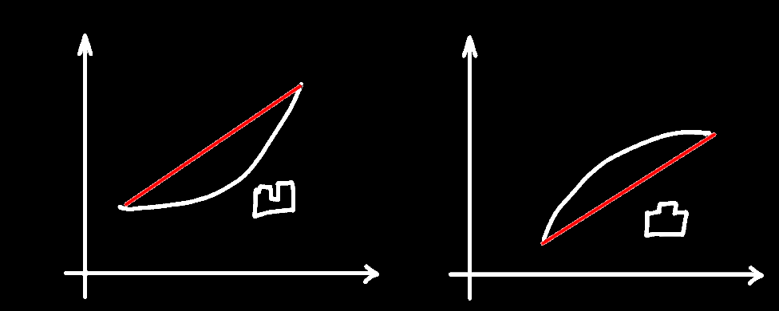
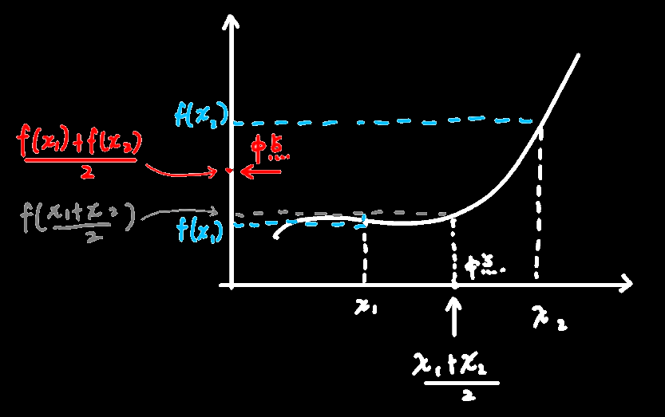
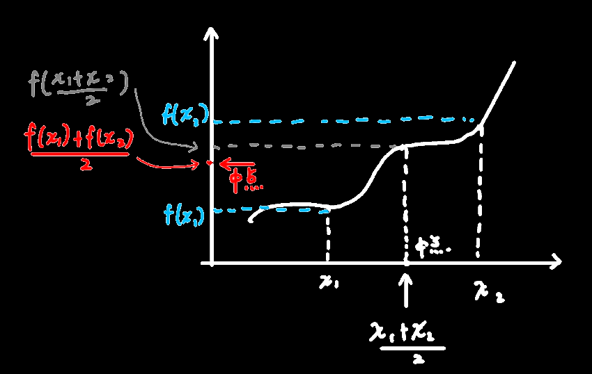

## 导数与凸凹性

------

#### 传统解释：

`凹函数`：从曲线上任取两点，过这两点的直线在曲线**上方**，定义：
$$
f(\dfrac{x_1+x_2}{2})<\dfrac{f(x_1)+f(x_2)}{2}
$$

由上图的图形化解释也可以看出，这个曲线越往下凹，y轴上灰色的点就越在 y轴红色点下方

------

`凸函数`：从曲线上任取两点，过这两点的直线在曲线**下方**，定义：
$$
f(\dfrac{x_1+x_2}{2})>\dfrac{f(x_1)+f(x_2)}{2}
$$

由上图的图形化解释也可以看出，这个曲线越往上凸，y轴上灰色的点就越在 y轴红色点上方

------

#### 导数解释：

f''(x)>0(斜率在不断地变大)：凹函数

f''(x)<0(斜率在不断地变小)：凸函数

`拐点`：就是函数的凹凸性改变的点，分为两种

1. 二阶导数为0的点
2. 二阶导数不存在的点

> 但是二阶导数为0或不存在并 不一定说明 该点是`拐点`，
>
> 二阶导数为0或不存在+已知该点后二阶导正负发生了改变 才能确定它是否为`拐点`
