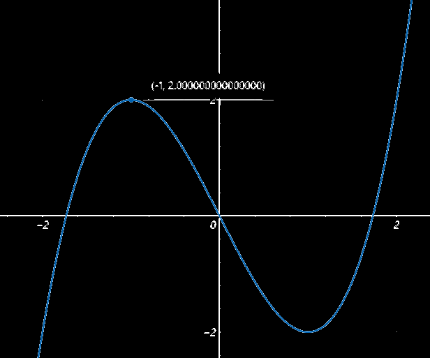

## 导数与单调性

在闭区间上连续，开区间可导，并且导数不变号时，若**导数>0，则为单调增**；若**导数<0，则为单调减**

注：若个别点上f'(x)≥0，仍然也是增函数；若个别点上f'(x)≤0，仍然也是减函数

例1：
$$
已知y=x-\sin x,求[0,2\pi]上是否为增函数\\
y'=1-\cos x\\
\because-1\le\cos x\le 1\\
\therefore y'\ge 0\\
\therefore 为增函数
$$

------

`分界点`：就是函数由单调增转为单调减的点，分为两种：

1. 导数为0的点，称为`驻点`
2. 导数不存在的点

因此计算==一个==函数的增减区间时一般都是求出`导函数`，然后设`导函数`=0，看当x为何值时为驻点

例2：
$$
f(x)=x^3-3x,求增减区间\\
f'(x)=3x^2-3=3(x^2-1)\\
设3x^2-3=0,解得x=\pm1\\
那函数的区间可以被分为下列五段
$$

|       | (-∞,-1) | -1   | (-1,1)  | 1    | (1,+∞)  |
| ----- | ------- | ---- | ------- | ---- | ------- |
| f'(x) | f'(x)>0 | 0    | f'(x)<0 | 0    | f'(x)>0 |
| f(x)  | 单调增  |      | 单调减  |      | 单调增  |

实际图像走势也确实符合刚才用 代数方法计算得到的 增减性规律

