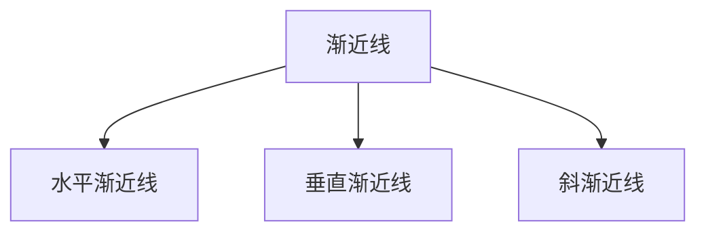
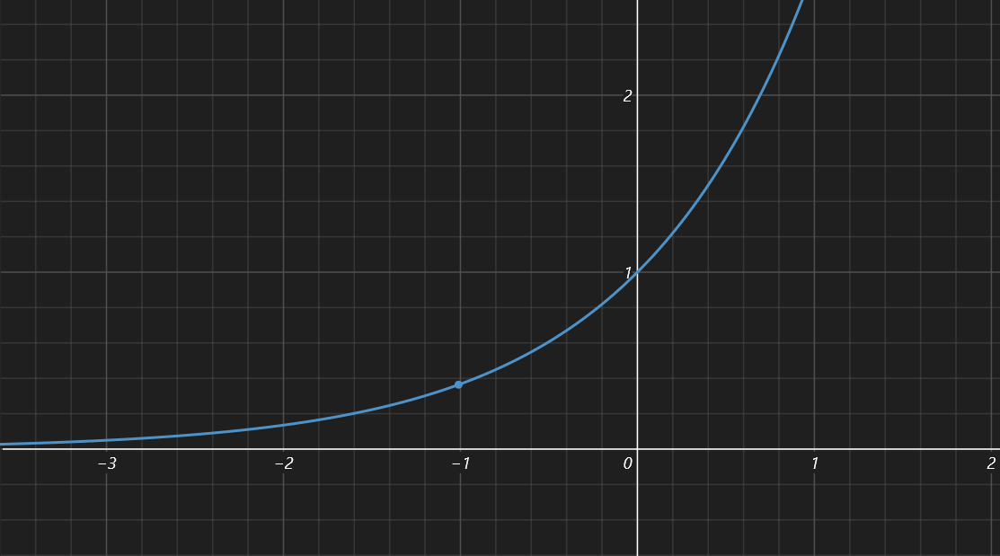
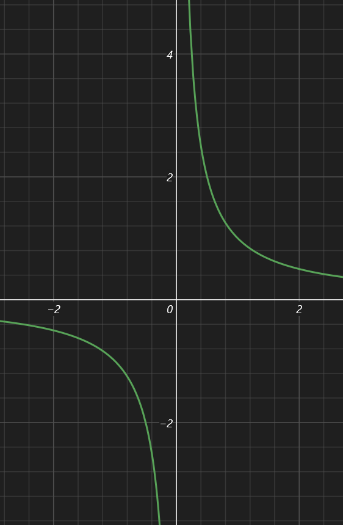
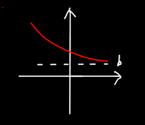
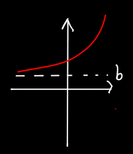
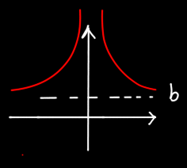
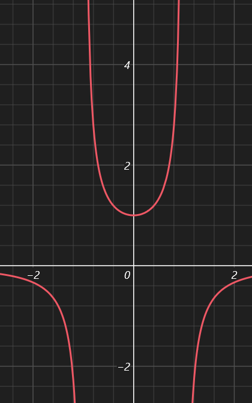
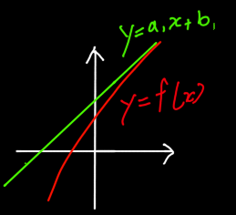
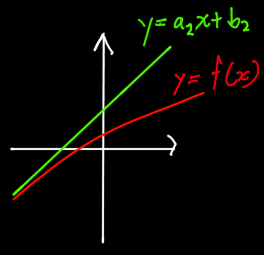
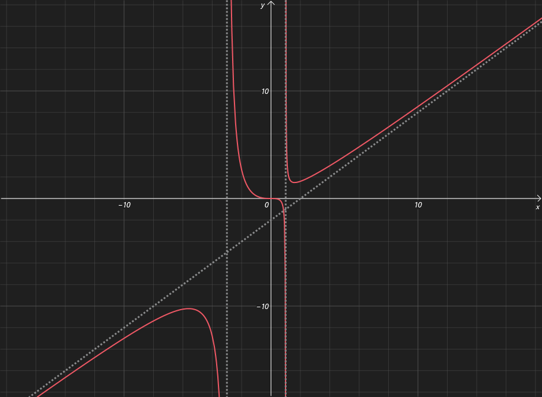

| 水平渐近线e.g.                                               | 垂直渐近线e.g.                                               | 斜渐近线e.g. |
| ------------------------------------------------------------ | ------------------------------------------------------------ | ------------ |
|  |  |              |
| $y=e^x$                                                      | $y=\dfrac1x,x\to0$                                           |              |

------

### 水平渐近线：

| $\lim_{x\to+\infty}f(x)=b$                                   | $\lim_{x\to-\infty}f(x)=b$                                   | $\lim_{x\to\infty}f(x)=b$                                    |
| ------------------------------------------------------------ | ------------------------------------------------------------ | ------------------------------------------------------------ |
|  |  |  |

如 $y=0$是 $y=\dfrac1{x-1}$的水平渐近线，其实还有一种情况：有的函数趋近于负无穷大和正无穷大时的水平渐近线是不同的，如 $y=\arctan(x)$

------

### 垂直渐近线：

$$
分为以下四种情况\\
\lim_{x\to c^+}f(x)=+\infty\\
\lim_{x\to c^+}f(x)=-\infty\\
\lim_{x\to c^-}f(x)=+\infty\\
\lim_{x\to c^-}f(x)=-\infty\\
$$

垂直渐近线有个特点：就是一般的来说都是让原式中的某个分母=0

因此：可计算 $y=\dfrac1{1-x^2}$ 趋近于-1^-^时为-∞，趋近于-1^+^时为+∞，趋近于1^-^时为+∞，趋近于1^+^时为-∞

综上所述：垂直渐近线为x=1或x=-1，也就是当 $1-x^2=0$ 时的解。

------

### 斜渐近线：

| 情况1                                                        | 情况2                                                        |
| ------------------------------------------------------------ | ------------------------------------------------------------ |
|  |  |
| $\lim_{x\to+\infty}f(x)-(a_1x+b_1)=0(因为这两条线的值很接近嘛)\\即\lim_{x\to+\infty}f(x)-a_1x=b_1$ | $\lim_{x\to-\infty}f(x)-a_2x=b_2$                            |
| $另一种表述方法:\lim_{x\to+\infty}\dfrac{f(x)}{x}\\=\lim_{x\to+\infty}\dfrac{a_1x+b_1}{x}\\=\lim_{x\to+\infty}(a_1+\dfrac{b_1}{x})\\=a_1\\(即当x趋于无限时函数值与自变量已经变成比例关系了)$ | $\lim_{x\to-\infty}\dfrac{f(x)}{x}=a_2$                      |

由于斜渐近线的条件是 $f(x)$ 比 $x$ 是一个常数，那 $f(x)$ 多半是一个近似于一次函数（或可以化简为一次函数）的东西，不然肯定比不出一个常数

如 $f(x)=\dfrac{x^5}{x^2+3x-3}$ ，五次比二次，那结果就是个三次的，再比上x不可能是常数，因此这个 $f(x)$ 不可能有斜渐近线

## 例题

#### 例1：

求 $f(x)=\dfrac{x^3}{x^2+2x-3}$ 的渐近线
$$
>>首先考察水平渐近线(趋近于无穷大时的)\\
\lim_{x\to\infty}\dfrac{x^3}{x^2+2x-3}=\lim_{x\to\infty}\dfrac{x}{1+2/x-3/x^2}=\infty无水平渐近线\\
>>然后考察垂直渐近线(一般分母为0时的)\\
x^2+2x-3=0,解得x=-3或1,因此x=-3或1是f(x)的垂直渐近线\\
>>接着是斜渐近线\\
\lim_{x\to\infty}\dfrac{f(x)}{x}=\lim_{x\to\infty}\dfrac{x^2}{x^2+2x-3}=\lim_{x\to\infty}\dfrac{1}{1+2/x-3/x^2}=1\\
(其实上面应该要分\lim_{x\to-\infty}和\lim_{x\to+\infty}来讨论的，不过对于这道题正负无穷大都是一样的，因此简写了)\\
因此那个所谓的a就是1，然后要求斜渐近线的b\\
b=\lim_{x\to\infty}(f(x)-ax)=\lim_{x\to\infty}(f(x)-x)=\lim_{x\to\infty}\dfrac{x^3-x^3-2x^2+3x}{x^2+2x-3}=\lim_{x\to\infty}\dfrac{-2x^2+3x}{x^2+2x-3}=-2\\
因此斜渐近线为y=x-2
$$

