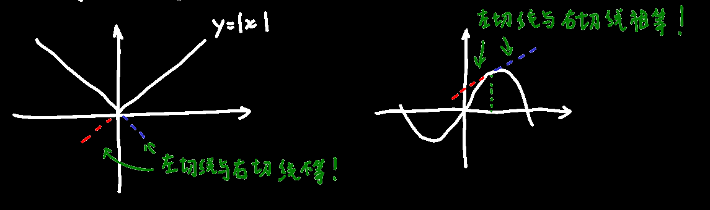
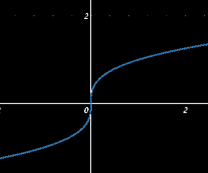
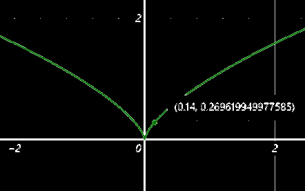

## 在某点可导定义

$$
y=f(x)在x_0的邻域(非去心邻域!)，写作U(x_0)，有定义；\\
且要求\triangle x\neq0，x_0+\triangle x\in U(x_0)，这是为了保证变化了以后依然有定义\\
\lim_{\triangle x\to 0}\dfrac{f(x_0+\triangle x)-f(x_0)}{\triangle x}=\lim_{h\to0}\dfrac{f(x_0+h)-f(x_0)}{h}
=f'(x_0)=y'|_{x=x_0}=\dfrac{dy}{dx}|_{x=x_0}=\dfrac{df(x)}{dx}|_{x=x_0}（导数的n种写法）\\
如果上述值存在，则说明函数f(x)在该点可导，且导数就为那个极限值\\
还有一种写法：\triangle x\to0,x=x_0+\triangle x,\lim_{x\to x_0}\dfrac{f(x)-f(x_0)}{x-x_0}\\
还有一种写法：设\triangle y=f(x_0+\triangle x)-f(x_0),\lim_{\triangle x\to0}\dfrac{\triangle y}{\triangle x}
$$

$$
导函数的写法汇总：
(当y=f(x)时)\dfrac{d}{dx}f(x)=\dfrac{dy}{dx}=y'_x=f'(x)
$$

#### 例1☆：

$$
已知y=x^2,求y'（求导函数时就是把上述的x_0改为x）\\
\triangle y=f(x+\triangle x)-f(x)=(x+\triangle x)^2-x^2=x^2+2x\triangle x+\triangle x^2-x^2=2x\triangle x+\triangle x^2\\
\lim_{\triangle x\to0}\dfrac{\triangle y}{\triangle x}=\lim_{\triangle x\to0}\dfrac{2x\triangle x+\triangle x^2}{\triangle x}\\
=\lim_{\triangle x\to0}2x+\triangle x=2x
$$

## 左右导数定义

==某点可导的条件是它的左右导数存在且相同==<--证明某点可导主要就是用这个定理
$$
若\lim_{\triangle x\to 0^-}\dfrac{\triangle y}{\triangle x}=f'_-{(x)}存在，则函数有左导数\\
若\lim_{\triangle x\to 0^+}\dfrac{\triangle y}{\triangle x}=f'_+{(x)}存在，则函数有右导数\\
$$

## 可导与连续性

对于一个函数，只能说==(a,b)开区间可导==，左端点右可导，右端点左可导；一点可导的前提是左右导数存在且相等，对端点也是如是要求的，因此端点无法满足要求，只能选用开区间

对于一个函数，可以说==[a,b]闭区间连续或==开区间连续，左端点右连续，右端点左连续；连续的定义不包括端点两边都要连续，因此端点能满足要求，可以用闭区间

>  不过有关连续的定理大多数都是建立在闭区间上的，因此连续大多数情况还是要用闭区间描述

可导的几何含义：光滑的	由于光滑的曲线那肯定是能一笔画的，因此==可导比连续的条件强==

#### 例2：

$$
判断y=|x|在x=0处是否可导：\\
f(x)=|x|=\left\{\begin{aligned}
x && x\ge0\\
-x && x<0
\end{aligned}\right.\\
f'_+(0)=\lim_{\triangle x\to 0^+}\dfrac{f(0+\triangle x)-f(0)}{\triangle x}=\dfrac{\triangle x}{\triangle x}=1\\
f'_-(0)=\lim_{\triangle x\to 0^-}\dfrac{f(0+\triangle x)-f(0)}{\triangle x}=\dfrac{-\triangle x}{\triangle x}=-1\\
f'_+(0)\neq f'_-(0)\\
则在x=0处不可导
$$

#### 例3：

$$
判断y=\sqrt[3]{x}在x=0处的可导性\\
f'_+(0)=\lim_{\triangle x\to 0^+}\dfrac{f(0+\triangle x)-f(0)}{\triangle x}=\lim_{\triangle x\to 0^+}\dfrac{\sqrt[3]{\triangle x}}{\triangle x}
=\lim_{\triangle x\to 0^+}\dfrac{1}{\triangle x^{\frac{2}{3}}}=+\infty\\
导数=无穷大相当于是导数没有定义，不存在，即不可导\\
从图像上来看，它的切线在x=0处是垂直的
$$

#### 例4：

$$
判断y=\sqrt[3]{x^2}在x=0处的可导性\\
f'_+(0)=\lim_{\triangle x\to0^+}\dfrac{f(0+\triangle x)-f(0)}{\triangle x}=\lim_{\triangle x\to0^+}\dfrac{\triangle x^{\frac23}-0}{\triangle x}=\lim_{\triangle x\to0^+}\dfrac{1}{\triangle x^{\frac13}}=+\infty\\
f'_-(0)=\lim_{\triangle x\to0^-}\dfrac{f(0+\triangle x)-f(0)}{\triangle x}=\lim_{\triangle x\to0^-}\dfrac{\triangle x^{\frac23}-0}{\triangle x}=\lim_{\triangle x\to0^-}\dfrac{1}{\triangle x^{\frac13}}=-\infty\\
这个是不仅导数不存在，而且左右导数不等
$$

