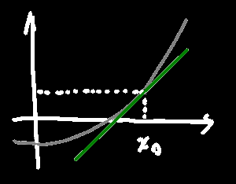
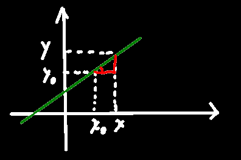

## 切线斜率

f(x)在x~0~处的导数等于过(x~0~, y~0~)的切线的斜率

则绿色的切线方程(点斜式)为
$$
y-f(x_0) = f'(x_0)(x-x_0)
$$
众所周知，与切线垂直的线叫法线，且若两条直线垂直，==斜率相乘等于-1==

所以f(x)在x~0~处的法线方程为
$$
y-f(x_0) = -\dfrac{1}{f'(x_0)}(x-x_0)
$$

> 扩展：
>
> 

>
> 点斜式方程y-y~0~=k(x-x~0~)中k代表此直线的斜率，此外，这条直线还必须经过点(x~0~, y~0~)
>
> 则任意取一点x，x与x~0~的距离差 乘上系数k 再加上y~0~等于y
>
> 从几何意义来看，确定一条直线需要两个点 或 斜率加一个点，点斜式方程需要的参数正好符合第二个斜线确定方式

