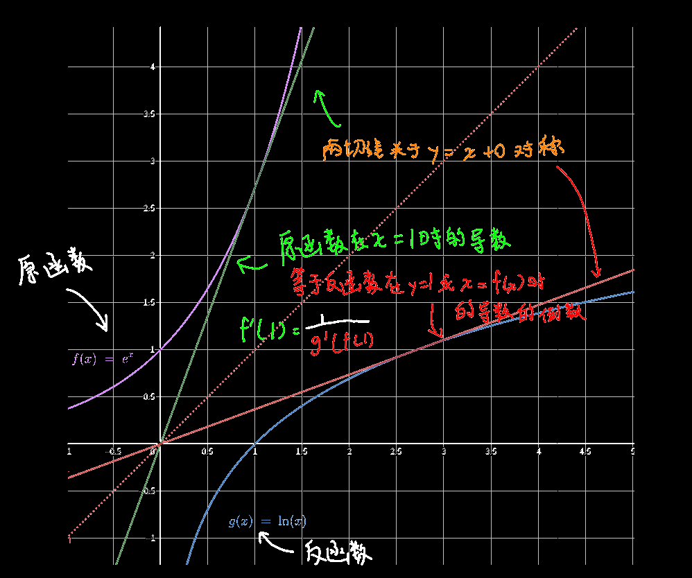

| 原函数         | 导函数               |
| -------------- | -------------------- |
| f(x)=c         | f'(x)=0              |
| f(x)=x^a^      | f'(x)=a·x^a-1^       |
| f(x)=log~a~x   | f'(x)=(1/x)log~a~e   |
| ☆☆f(x)=ln(x)   | f'(x)=1/x            |
| f(x)=a^x^      | f'(x)=a^x^lna        |
| ☆☆f(x)=e^x^    | f'(x)=e^x^           |
| f(x)=sin(x)    | f'(x)=cos(x)         |
| f(x)=cos(x)    | f'(x)=-sin(x)        |
| f(x)=tan(x)    | f'(x)=sec^2^(x)      |
| f(x)=cot(x)    | f'(x)=-csc^2^(x)     |
| f(x)=sec(x)    | f'(x)=sec(x)·tan(x)  |
| f(x)=csc(x)    | f'(x)=-csc(x)·cot(x) |
| f(x)=arcsin(x) | f'(x)=1/√(1-x^2^)    |
| f(x)=arccos(x) | f'(x)=-1/√(1-x^2^)   |
| f(x)=arctan(x) | f'(x)=1/(1+x^2^)     |
| f(x)=arccot(x) | f'(x)=-1/(1+x^2^)    |

## 求导拆分

$$
注：以下求导拆分的前提条件都是u(x)、v(x)等可导\\
1.(u(x)+v(x))'=u'(x)+v'(x)\\
注：有限个相加\ \ \ (u_1(x)+u_2(x)+\cdots+u_n(x))'=u_1'(x)+u_2'(x)+\cdots+u_n'(x)\\
2.(u(x)v(x))'=u'(x)v(x)+u(x)v'(x)\\
(u_1(x)u_2(x)u_3(x))'=u_1'(x)u_2(x)u_3(x)+u_1(x)u_2'(x)u_3(x)+u_1(x)u_2(x)u_3'(x)\\
3.(c\cdot u(x))'=(常数求导为0)\ \ c'u(x)+c\cdot u'(x)=c\cdot u'(x)\\
4.\left(\frac{u(x)}{v(x)}\right)'=\dfrac{u'(x)v(x)-u(x)v'(x)}{v(x)^2}上撇下减下撇上除下方\\
5.两个互为反函数的函数(y=f(x)与y=f^{-1}(x)，f'(x_0)=\dfrac{1}{f^{-1'}(f(x_0))}（见例题2）
$$

## 例题(分式拆分、反函数求导)

$$
(\tan x)'=(\dfrac{\sin x}{\cos x})'=\dfrac{\sin'x\cos x-\sin x \cos 'x}{\cos^2x}=\dfrac{\cos^2x+\sin^2x}{\cos^2 x}=\dfrac{1}{\cos^2 x}=\sec^2 x\\
$$

$$
(a^x)'=\dfrac{1}{\log_a(y)'}=\dfrac{1}{\dfrac{1}{y}\log_ae}=\dfrac{1}{\dfrac{\ln e}{y\ln a}}=\dfrac{1}{\dfrac{1}{y\ln a}}=y	\ln a=a^x\ln a
$$

对上述结果的理解：在f(x)=a^x^中x=x~0~位置处的导数，等于f(x)的反函数在y=x~0~处的导数的倒数（两直线斜率互为倒数，关于过两直线的交点且k=1的直线对称）

