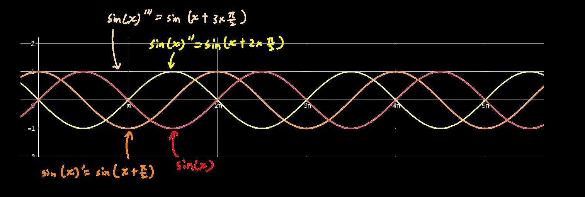

## 引出

设y=x^3^，则y'=3x^2，y''=6x，y'''=6，后面的二阶导、三阶导即为高阶导数

符号表达：
$$
二阶导：y''或f''(x)，严格写作\dfrac{d^2y}{dx^2}\\
三阶导：y'''或f'''(x)，严格写作\dfrac{d^3y}{dy^3}\\
n阶导：y^{(n)}或f^{(n)}(x)，严格写作\dfrac{d^ny}{dy^n}
$$

$$
为什么写作\dfrac{d^2y}{dx^2}?，因为\dfrac{d^2y}{dx^2}=\dfrac{d}{dx}\times\dfrac{dy}{dx}
$$

## 例题

$$
y=x^3\ln x\\
y'=3x^2\ln x+x^3\times\dfrac1x=3x^2\ln x+x^2\\
y''=3\times(2x\ln x+ x^2\times\dfrac1x)+2x=3\times(2x\ln x+ x)+2x=6x\ln x+5x\\
y'''=6\times(x\ln x)+5=6\times(\ln x+1)+5x=6\ln x+5+6=6\ln x+11
$$

## 一些定理

$$
\sin^{(n)}=\sin(x+\dfrac{nx}{2})\\
$$
$$
(u\pm v)^{(n)}=u^{(n)}\pm v^{(n)}\\
$$
$$
c为常数,(cu)^{(n)}=cu^{(n)}\\
$$
$$
(uv)^{(n)}=\sum_{i=0}^{n}C_n^iu^{n-i}v^i
$$

## 神奇的sin(x)

sin(x)的n阶导函数就是sin(x)往左平移n次，每次距离为π/2
