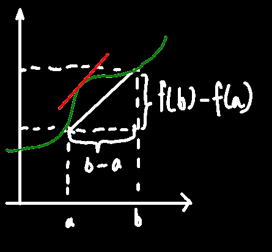

# 微分中值定理

## 费马引理

f(x)在U(x~0~)有定义，在x~0~处**可导**，如果f(x)**≤**f(x~0~)或f(x)**≥**f(x~0~)，任给==x∈U(x~0~)==，则f'(x~0~)=0

> 驻点、稳定点、临界点：导数为0的点，注意导数等于0不一定意味着该点为极值点

说白了就是如果x~0~处于函数中一个==小邻域==的**最高点**或**最低点**时，则该点的切线是水平的

证：
$$
x\in U(x_0),f(x)\le f(x_0)\\
设x_0+\triangle x\in U(x_0)\\
(因为前面说在U(x_0)区间里任何数的函数值都比在x_0处小吗，x_0+\triangle x就是上述的'任何数')\\
则f(x_0+\triangle x)\le f(x_0)\\
即f(x_0+\triangle x)-f(x_0)  \le 0\\
f'_-(x_0)=\lim_{\triangle x\to 0^-}\dfrac{f(x_0+\triangle x)-f(x_0)}{\triangle x}\ge 0 \\
(前面说了f(x_0)更大，因此分母为负，\triangle x 又趋近于-0，因此整个分式≥0)\\
f'_+(x_0)=\lim_{\triangle x\to 0^+}\dfrac{f(x_0+\triangle x)-f(x_0)}{\triangle x}\le 0\\
又\because在x_0处有导数，说明左右导数都相等，因此f'(x_0)只能等于0
$$

## 罗尔中值定理

f(x)满足在[a,b]之间连续，(a,b)之间可导，f(a)=f(b)则：

至少存在一点ξ∈(a,b)，f'(ξ)=0

> 直观理解：由于ab处于同一高度，所以ab之间连起来那条线最多是平的，不可能单调增或单调减
>
> 因此ab之间那条线只有两种情况，就是完全平的，或者有“凸起”的那种，有凸起又说了(a,b)之间都是可导的，因此根据费马引理，肯定有至少一点导数为0

## 拉格朗日中值定理

f(x)满足在[a,b]之间连续，(a,b)之间可导，没有第三个要求，则：

至少存在一点ξ∈(a,b)，f(b)-f(a)=f'(ξ)(b-a)

也就是
$$
f'(\xi)=\dfrac{f(b)-f(a)}{b-a}
$$

也就是说，在(a,b)中，至少有一点ξ处的切线斜率，等于过a,b两个端点的直线的斜率

## 柯西中值定理

若有f(x)和F(x)，满足在[a.b]上连续，在(a,b)上可导，任取x∈(a,b)，f'(x)≠0，则：
至少存在一点ξ，使得
$$
\dfrac{F(b)-F(a)}{f(b)-f(a)}=\dfrac{F'(ξ)}{f'(ξ)}
$$

### 直观图像化理解(非严格证明)：

若对上图中红色曲线进行微分：
$$
\dfrac{dQ}{dP}=\dfrac{\dfrac{dQ}{dx}}{\dfrac{dP}{dx}}=\dfrac{F'(x)}{f'(x)}
$$
因此红色图像上x处的斜率等于F'(x)/f'(x)

又知道一条“不间断”且“平滑”曲线经过左右两点，曲线上必然存在一点的斜率 等于 两点连成线的斜率