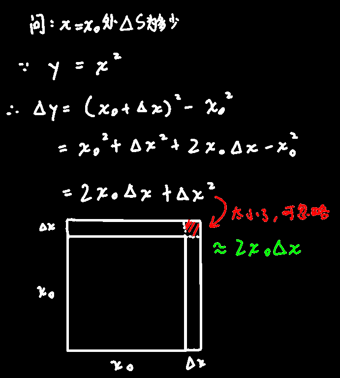
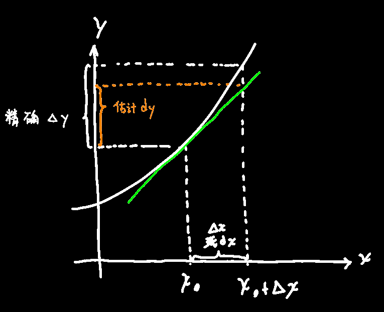

## 引入

## 定义

如果f(x)在x~0~邻域内有定义，且x~0~+△x在邻域内仍然有定义
$$
若\triangle y=f(x_0+\triangle x)-f(x_0)可表示为\triangle y=A\triangle x+\mathcal{O}(\triangle x)\\
(A与x_0有关，与\triangle x无关，后面的高阶无穷小表示\triangle x趋近于0时\mathcal{O}里面的也趋近0，可以忽略)\\
则说明f(x)在x_0处可微\\
记作dy=A\triangle x=f'(x)\triangle x=f'(x)dx
$$
==△y是精确值，dy是近似值==，因为dy把后面的高阶无穷小给去掉了（不过dx和△x是一个东西）

dy就是所谓的“微分值”

☆f(x)在x~0~处可微的充要条件是f(x)在x~0~处可导，便可微时==dy=f'(x~0~)△x=f'(x~0~)dx==

> 由此也说明为什么 $\dfrac{dy}{dx}=f'(x)$

## 几何意义

$$
f(x_0+\triangle x)\approx f(x_0)+f'(x_0)\triangle x
$$

## 关于定义表达的例题

$$
求f(x)=x^2在x=2处的微分，并且在x=2时当\triangle x=0.01，求函数的改变量和微分值\\
dy=f'(x)\triangle x=2x\triangle x\\
dy|_{x=2}=4\triangle x\\
dy|_{x=2}^{\triangle x=0.01}=4\times 0.01=0.04
$$

## 基本运算

$$
d(u\pm v)=(u+v)'dx=(u'+v')dx=u'dx+v'dx=du\pm dv\\
d(u\times v)=vdu+udv\\
(c为常数)d(cu)=cdu\\
d(\frac u v)=\frac{vdu-udv}{v^2}
$$

（个人感觉不用像上面那样拆改来再求导，直接把d()括号里的东西先求导好不香吗）

## 全微分形式不变性

>  先用一阶微分形式不变性解释一下
>
> 假设对y=f(u)求微分，
>
> 1. 假设u是自变量，则dy=f'(u)du
> 2. 假设u是中间变量，是一个函数，u=φ(x)，则dy=f'(x)dx=f'(u)φ'(x)dx=f'(u)du
>
> 由于不管u是自变量还是中间变量，dy的表达公式都是相同的，所以就叫一阶微分形式不变性

例：
$$
已知y=e^{\sin^2x}，求dy\\
普通写法(直接对整体求微分)：dy=y'dx=(e^{\sin^2x}\times2\sin x\times\cos x)dx\\
微分写法：dy=d(e^{\sin^2x})=(e^{\sin^2x})'d(\sin^2x)=(e^{\sin^2x})d(\sin^2x)\\
=(e^{\sin^2x})(\sin^2x)'d(\sin x)=(e^{\sin^2x})(2\sin x)d(\sin x)\\
=(e^{\sin^2x})(2\sin x)(\sin x)'dx=(e^{\sin^2x})(2\sin x)(\cos x)dx\\
=(e^{\sin^2x}\times2\sin x\times\cos x)dx
$$
