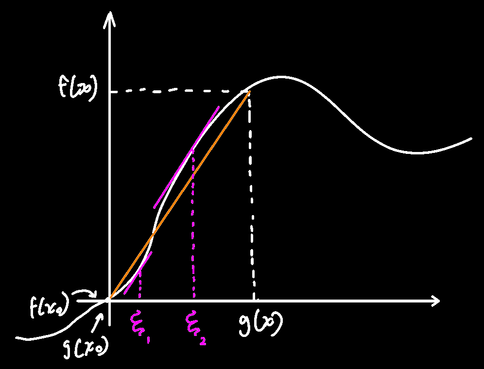

## 洛必达法则(洛必达从伯努利那买来的法则)

> 不要一味地使用洛必达法则解决极限问题，与`重要极限`，`无穷小替换`，一起食用味更佳

用于解决以下问题：

1. 已知f(x)→0，g(x)→0，求f(x)/g(x)
2. （见扩展）已知f(x)→∞，g(x)→∞，==不一定同时趋近于正无穷或负无穷==，可以一个趋近于正无穷，一个趋近于负的，求f(x)/g(x)

定理内容：若f(x)和g(x)满足以下三个条件(注：下述两导数比值为a或∞中，==a是允许为0的==，不要把无穷小跟0的概念搞混了)
$$
①\lim_{x\to x_0}f(x)=\lim_{x\to x_0}g(x)=0\\
②在x_0的某个领域内(x_0可除外)都可导，且g'(x)\neq0\\
③\lim_{x\to x_0}\dfrac{f'(x)}{g'(x)}=a或\lim_{x\to x_0}\dfrac{f'(x)}{g'(x)}=\infty
$$
则：
$$
\lim_{x\to x_0}\dfrac{f(x)}{g(x)}=\lim_{x\to x_0}\dfrac{f'(x)}{g'(x)}=a(或\infty)
$$

☆ 如果将f'(x)和g'(x)看做两个独立的函数，则可继续洛它（前提是这个两导函数在x趋于x~0~时都等于0或都等于∞）：
$$
\lim_{x\to x_0}\dfrac{f(x)}{g(x)}=\lim_{x\to x_0}\dfrac{f'(x)}{g'(x)}=\lim_{x\to x_0}\dfrac{f''(x)}{g''(x)}=\lim_{x\to x_0}\dfrac{f'''(x)}{g'''(x)}=a(或\infty)
$$

☆ 若f'(x)或g'(x)的极限不存在，并==不能断言f(x)或g(x)的极限不存在==，只能说明这道极限计算的题目不能用洛必达法则推导，例：
$$
\lim_{x\to \infty}\dfrac{x+\sin x}{x}=若使用洛必达法则，上下求导=\lim_{x\to \infty}\dfrac{1+\cos x}{1}\\
分母肯定没问题，都是常数了那肯定有极限，但分子上是一个周期函数，x趋于无穷，我们并不知道\cos x到底趋于什么值，因此极限不存在\\
因此不能使用洛必达，另一种做法：\\
=1+\lim_{x\to \infty}\dfrac{\sin x}{x}=1+0(一个分式上有界，下无穷，比值为0)=1
$$

☆ 聪明点，怎么少走弯路
$$
\lim\dfrac{趋近于0的式子}{(趋近于具体数字的式子)\times(趋近于0的式子)}=零比零型的，按理来说是要继续求导的，\\
但是观察一下，其实可以把(趋近于具体数字的式子)提出来，下次就不用对它求导了\\
=\dfrac{1}{趋近于具体数字的式子}\times\lim\dfrac{趋近于0的式子}{趋近于0的式子}
$$

## 证明(不是很严格只是帮助理解)

$$
假设f(x_0)=g(x_0)=0，配合条件\lim_{x\to x_0}f(x)=\lim_{x\to x_0}g(x)=0可得f(x)与g(x)都在x_0处连续(端点连续)\\
同时f(x)与g(x)都在x处连续，这个emm有点抽象，就是实际使用洛必达法则时里面肯定写的是一个具体的数，因此肯定是\ 额\ 连续的\\
同时还知道在x_0的某邻域内都可导，且g'(x)\neq0\\
因此可使用柯西中值定理(柯西要求的是两函数[开区间连续，闭区间可导]；但因为可导必连续，因此这个要求同[闭区间可导且两端点连续])\\
\dfrac{f(x)-f(x_0)}{g(x)-g(x_0)}=\dfrac{f'(\xi)}{g'(\xi)},\xi\in(x_0,x)\\
\because f(x_0)=g(x_0)=0\\
\therefore \dfrac{f(x)}{g(x)}=\dfrac{f'(\xi)}{g'(\xi)},\xi\in(x_0,x)\\
对上式两边取极限\\
\lim_{x\to x_0}\dfrac{f(x)}{g(x)}=\lim_{x\to x_0}\dfrac{f'(\xi)}{g'(\xi)}\\
\because \xi\in(x_0,x)\\
\therefore \lim_{x\to x_0}\dfrac{f(x)}{g(x)}=\lim_{x\to x_0}\dfrac{f'(x)}{g'(x)}=a(或\infty)\\
(因为上述等式只要求x趋近于x_0,因此洛必达法则没要求f(x_0)=g(x_0)=0?)
$$

