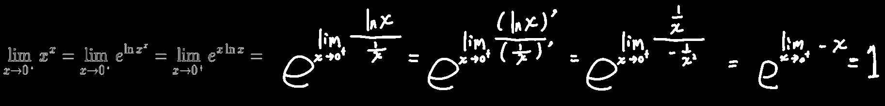

## 洛必达法则-扩展(趋于∞时)

上述的三个条件其实可以改为f(x)与g(x)同时趋近于无限，（但==不一定同时趋近于正或负无穷大==，可以一个趋近于正无穷，一个趋近于负无穷）
$$
①\lim_{x\to x_0}f(x)=\lim_{x\to x_0}g(x)=\infty\\
②在x_0的某个领域内(x_0可除外)都可导，且g'(x)\neq0\\
③\lim_{x\to x_0}\dfrac{f'(x)}{g'(x)}=a或\lim_{x\to x_0}\dfrac{f'(x)}{g'(x)}=\infty
$$
因为分式中两个趋于∞的函数可以转化为两个趋近于0的函数，如 
$$
\lim_{x\to+\infty}\dfrac{\ln x}{\sqrt{x}}一个指数函数，一个底数函数，都是趋近于\infty的\\
=\lim_{x\to+\infty}\dfrac{\dfrac{1}{\sqrt x}}{\dfrac{1}{\ln x}}，但是任何趋近于\infty的数放在分母上不就趋近于0了吗\\
=\lim_{x\to+\infty}\dfrac{\ln x}{\sqrt{x}}=\lim_{x\to+\infty}\dfrac{(\ln x)'}{(\sqrt{x})'}=\lim_{x\to+\infty}\dfrac{\dfrac1x}{\dfrac12\dfrac{1}{\sqrt x}}\\
=\lim_{x\to+\infty}\dfrac{\dfrac2x}{\dfrac22\dfrac{1}{\sqrt x}}=\lim_{x\to+\infty}\dfrac{\dfrac2x}{\dfrac{1}{\sqrt x}}=\lim_{x\to+\infty}\dfrac{2}{\sqrt x}=0
$$

> (虽然不是很懂，但是在使用洛必达法则时不需要对改成1/?的函数求导，就==对原本的函数直接求导==就行)

## 洛必达法则-终极版

$$
形如\dfrac0\infty,0^0,1^\infty,\infty^0的式子都可以使用洛必达，只是需要一点[转化]
$$

------

例1：
$$
\lim_{x\to 0}x^2e^{\frac{1}{x^2}}=\lim_{x\to 0}\dfrac{e^{\frac{1}{x^2}}}{\frac{1}{x^2}}=\lim_{x\to 0}\dfrac{(e^{\frac{1}{x^2}})'}{(\frac{1}{x^2})'}=\lim_{x\to 0}\dfrac{e^{\frac{1}{x^2}}\times\frac{0-2x}{x^4}}{\frac{0-2x}{x^4}}=\lim_{x\to 0}e^{\frac{1}{x^2}}=\infty
$$
例2(卧槽这题分式套娃有点多，只能手写了)：

