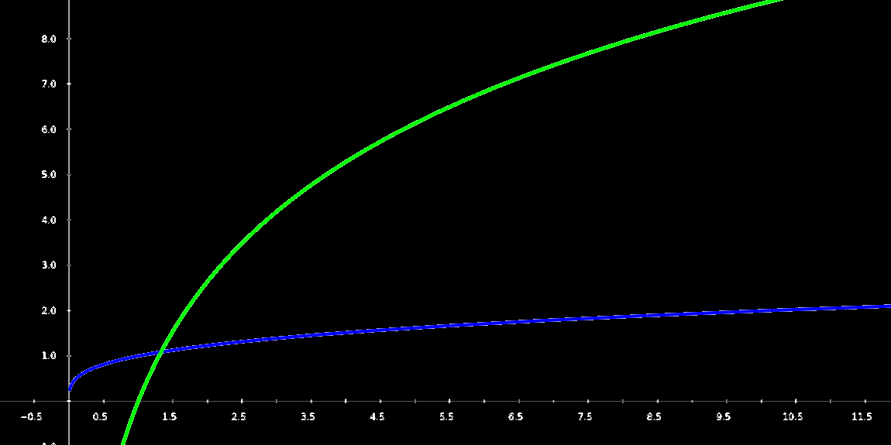
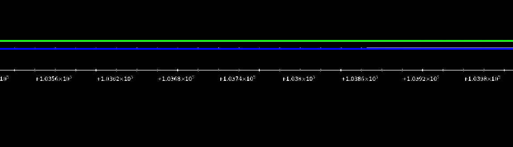
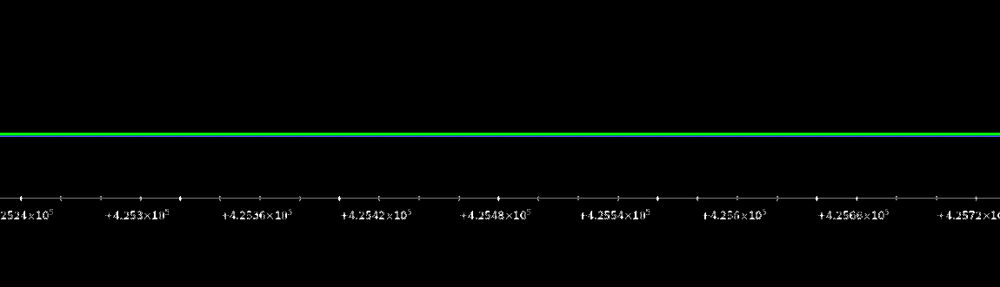
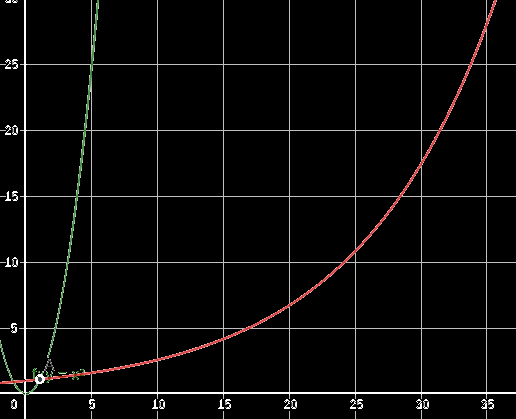
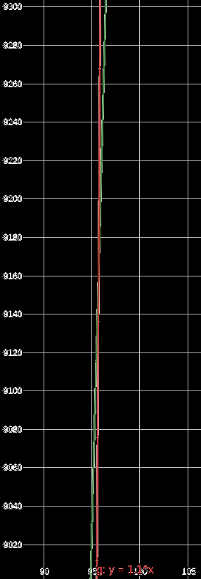

# 大pk:当x趋近于+∞时，谁最大

$$
最终结论：当(a>1,b>0,c>1)且\lim_{x\to+\infty}时\log_ax<x^b<c^x\\
趋近于+\infty对数函数<幂函数<指数函数
$$

## 对数函数vs幂函数

$$
图像理解：绿色曲线为\log_{1.3}x，一个很强的对数函数；蓝色曲线为x^{0.3}，一个很菜的幂函数
$$

$$
看来在(0,10)区间里咱的对数函数遥遥领先啊
$$

$$
但是我们的幂函数选手后劲比较足，在之后的10^4距离中在慢慢地追上对数函数选手
$$

$$
终于幂函数在4.25\times10^4左右终于追上对数函数了，因此得到结论，不管多烂的幂函数终究有一天能追上一个看起来很厉害的对数函数
$$

------

严格证明：
$$
\lim_{x\to+\infty}\dfrac{\log_ax}{x^b}=\lim_{x\to +\infty}\dfrac{\dfrac1x\log_ae}{bx^{b-1}}=\lim_{x\to +\infty}\dfrac{\dfrac1b\log_ae}{x\cdot x^{b-1}}=\lim_{x\to +\infty}\dfrac{\dfrac1b\log_ae}{x^{b}}=上常数，下无穷，比值为=0\\
因此\log_ax趋近于无穷速度比x^b慢
$$

## 幂函数vs指数函数

$$
图形理解：绿色曲线为x^{2}，一个很强的幂函数；红色曲线为1.1^x，一个很菜的指数函数
$$

$$
在(0,35)区间里幂函数遥遥领先
$$

$$
两函数看似实力悬殊，但可以看到在大概在(96,9160)处指数函数终于赶超了幂函数\\
因此再菜的指数函数都比幂函数强，只是交点x处得大点罢了
$$

------

严格证明：
$$
\lim_{x\to+\infty}\dfrac{x^n}{e^{\lambda x}}=\lim_{x\to+\infty}\dfrac{nx^{n-1}}{e^{x^{\lambda}}}=\lim_{x\to+\infty}\dfrac{nx^{n-1}}{\lambda e^{x^{\lambda-1}}\times e^x}=\lim_{x\to+\infty}\dfrac{nx^{n-1}}{\lambda e^{x^{\lambda}}}=\lim_{x\to+\infty}\dfrac{nx^{n-1}}{\lambda e^{\lambda x}}\\
=\lim_{x\to+\infty}\dfrac{n(n-1)x^{n-2}}{\lambda e^{\lambda x}}=\cdots(一直洛必达，求导k次，直到n-k为一个负小数或0)\\
=\lim_{x\to+\infty}\dfrac{n(n-1)(n-2)\cdots }{x^{n-k}\lambda e^{\lambda x}}=下无穷大，上为常数，比值为=0
$$
