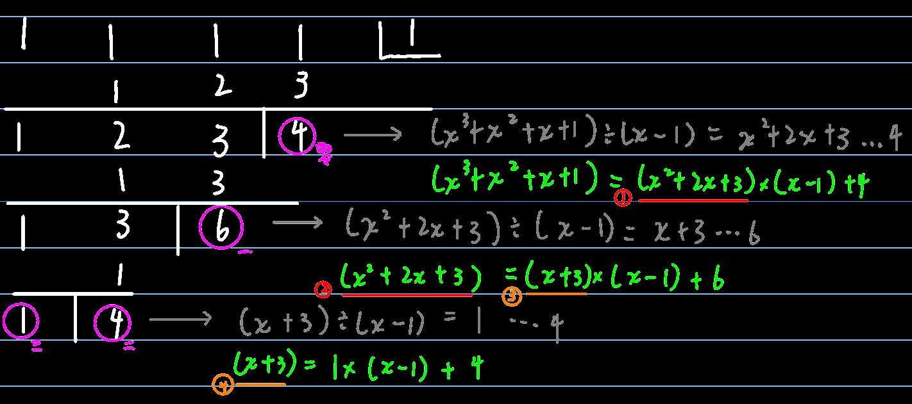

## 综合除法

综合除法(synthetic division)是一种简便的除法，只通过乘、加两种运算便可计算到一元多项式除以(x - a)的商式与余式

$$
即(x^3+x^2+x+1)\div (x-1)=x^2+2x+3\cdots 4\\
如果化简右方通用式竖线后面的结果：\\
((a_1\times a+a_2)\times a+a_3)\times a+a_4\\
=(a_1a^2+a_2a+a_3)\times a+a_4\\
=a_1a^3+a_2a^2+a_3a+a_4\\
即多项式除(x-a)后留下余数的值\ 等于\ 原多项式当x=a时的值\\
此结论在《泰勒多项式-2.引入》中有使用
$$

## 除法原理

$$
\because F\div P=Q\cdots r\\
\therefore F=QP+r\\
如果用除法原理重写如上的有理式除法：\\
即(x^3+x^2+x+1)=(x^2+2x+3)\times(x-1)+4
$$

## 多项式多次除以(x-a)

综合除法就这点方便，如果还要除以一次刚才的(x-a)，可以就着上一步的结果继续往下写，具体步骤还是一样的：

第一个数挪下来，与`a`相乘，然后跟第二个数相加，挪下来……

若将②处带入①处，再将④处带入③处，如此递归循环带入，即可得到如下等式
$$
(x^3+x^2+x+1)+0\\
=(x^2+2x+3)(x-1)+4\\
=[(x+3)(x-1)+6](x-1)+4\\
=\{[(x-1)+4](x-1)+6\}(x-1)+4\\
=[(x-1)^2+4(x-1)+6](x-1)+4\\
=(x-1)^3+4(x-1)^2+6(x-1)+4
$$

>  仔细观察，其实可以发现一个规律：
>
>  x^3^+x^2^+x+1可转换为一个由(x-1)组成的多项式，三次项的系数其实就来源于上图中的(**三**)，二次项系数来源于(**二**)>，一次项系数来源于(**一**)>，常数项来源于(**零**)

## `泰勒多项式`的例子

而刚才做的转换是有专门的术语来描述的：

注：泰勒多项式的标准写法是要求`升幂排列`的
$$
x^3+x^2+x+1\\
以1为参考点的泰勒多项式/泰勒形式是4+6(x-1)+4(x-1)^2+(x-1)^3\\
以0为参考点的泰勒多项式/泰勒形式是1+x+x^2+x^3
$$

