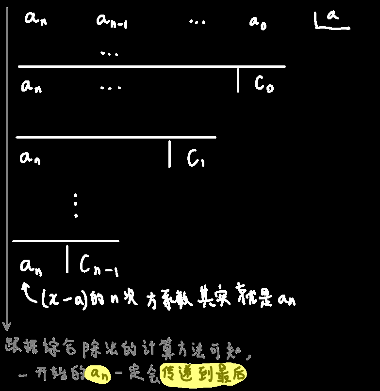

## 定义

$$
设f(x)=a_nx^n+a_{n-1}x^{x-1}+a_{n-2}x^{x-2}+\cdots+a_0\\
对上式除(x-a)，用综合除法计算，设每第一步算出的结果竖线后面的值为c_0，第二步后面的为c_1，以此类推，则最后一个结果竖线后面的值为c_{n-1}
$$

$$
则原函数可写作f(x)=c_0+c_1(x-a)+c_2(x-a)^2+\cdots+a_n(x-a)^n
也就是f(x)以a为参考点时的泰勒展开式\\
\because 《泰勒多项式-1.引入》-综合除法\ 中总结的那条规律——c_0=f(a)\\
\therefore 则原函数可写作f(x)=f(a)+c_1(x-a)+c_2(x-a)^2+\cdots+a_n(x-a)^n
$$

> 所有种类的多项式都可以写成  以a为参考点的`泰勒形式`的多项式

$$
上述规律除了可以用综合除法的规律解释外，还可以用代数方法解释\\
假设x=a，则\\
f(a)=f(a)+c_1(a-a)+c_2(a-a)^2+\cdots+a_n(a-a)^n\\
f(a)=f(a)\\
成立
$$

## 泰勒形式的意义——意在估计

$$
f(x)=x^3+x^2+x+1，求f(0.98)的值\\
可以用以1为参考点的泰勒形式来估计\\
f(x)=f(1)+c_1(x-1)+c_2(x-1)^2+c_3(x-1)^3\\
有什么用呢？\\
将x=0.98带入上述泰勒展开式，得\\
f(0.98)=f(1)+c_1(0.98-1)+c_2(0.98-1)^2+c_3(0.98-1)^3\\
一般来说，前面的系数c不会太大，0.98和一个靠近它的数相减肯定是个小数，小数平方就是很小的数，小数的三次方那就是超级小的数\\
因此：可以将泰勒展开式的后面两项省略掉\\
f(0.98)\approx f(1)+c_1(0.98-1)\\
c_1前面前面《泰勒多项式-1.引入》计算过，等于6\\
则f(0.98)\approx4-0.12=3.88\\
而实际值为3.881592，很接近吧😚
$$

