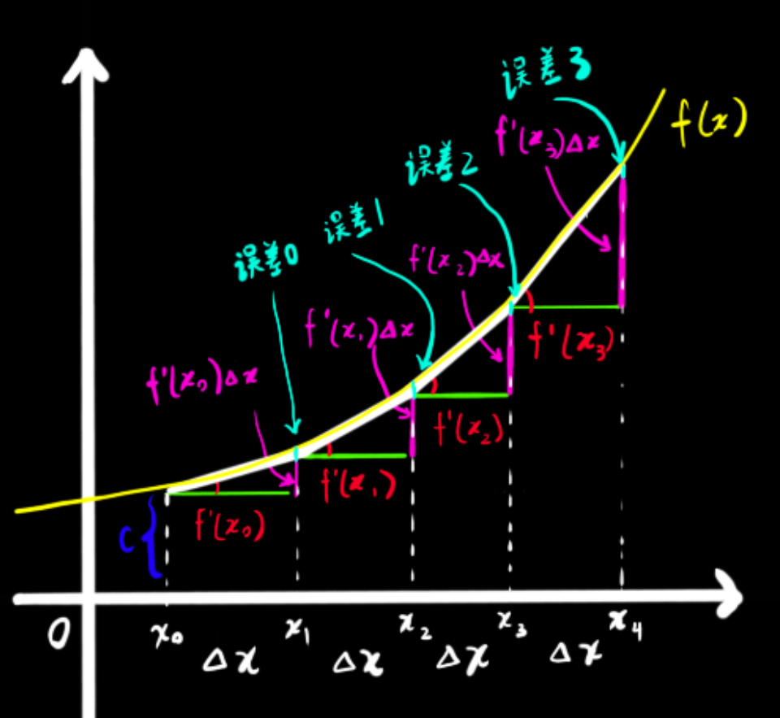
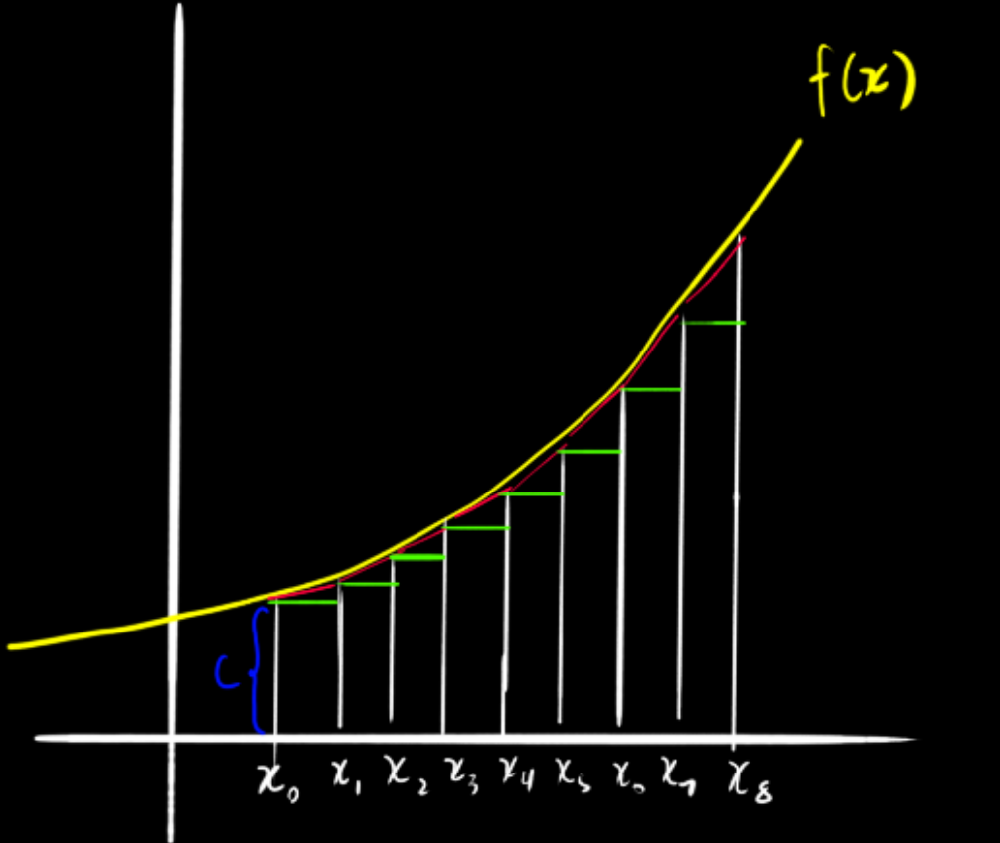
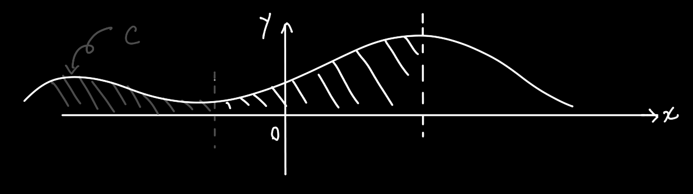
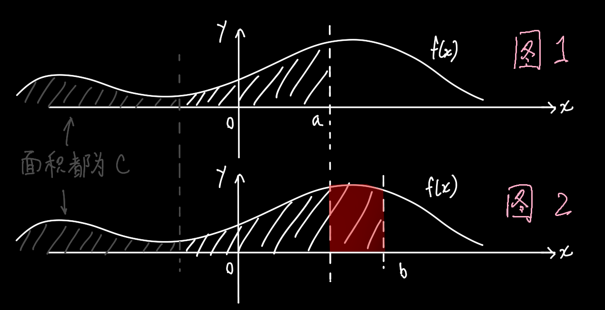

使用计算器计算 <b>含有三角函数</b> 的积分表达式时，注意要把模式从"角度"切换为"弧度"

## 定义

若 $F'(x)=f(x)$，则 $F(x)$ 是 $f(x)$ 的==一个==`原函数`

即 $f(x)$ 的==全体==`原函数`，记作 $\int{f(x)dx}$，其中 $x$ 叫积分变量 ，$f(x)$ 称为被积函数，$f(x)dx$ 称为被积表达式

在积分问题中，一般把原函数记作大写 $F(x)$

如果对于 $f(x)$，能找到一个原函数 $F(x)$，则它的全体原函数集合为 $F(x)+c$ ，因为反过来讲，常数c在求导时会被省略去

------

$$
例1:\int x^2dx=\dfrac13x^3+c
$$

$$
例2:已知某函数f(x)的切线斜率为2x,且经过(2,5),求f(x)\\
给出切线斜率，相当于告诉你f(x)的导函数,即f'(x)=2x\\
\int 2xdx=x^2+c\\
5=2^2+c\\
c=1\\
\therefore f(x)=x^2+1
$$

## 性质

$$
\left(\int f(x)dx\right)'=f(x)\\
\int f'(x)dx=f(x)+c
$$

$$
\int kf(x)dx=k\int f(x)dx
$$

$$
\int(f_1(x)+f_2(x)+...+f_n(x))dx=\int f_1(x)dx+\int f_2(x)dx+...+\int f_n(x)dx\\
注:n为有限个
$$

## 当f(x)表示导函数时不定积分、定积分的图形意义

如图，当我们想知道 $f(x_4)$ 时的值时，可以通过 $c+f'(x_0)\triangle x+f'(x_1)\triangle x+f'(x_2)\triangle x+f'(x_3)\triangle x$ 求得

即 $f(x_4)=c+\sum_{n=0}^{3}f'(x_n)\triangle x求得$。但是，每一次的 $f'(x)\triangle x$，即 $dy$，都只是通过导数预估出的数字，跟真实的 $\triangle y$ 是有误差的。但是如果 $\triangle x$ 越来越小，逐渐接近0，那么误差也会越来越小，使最终求和得出的 $f(x)$ 更接近真实的 $f(x)$。

但是相应的，"采样点"也会变得更多。此时 $f(x)=c+\sum_{n=0}^{8}f'(x_n)\triangle x$，如果想要预测的 $f(x)$ 无限趋近于真实的函数值，那 $\triangle x$就得趋近于0，而 $\sum $ 上面的数字也就得要趋近于 $\infty$ ，为了表示方便，数学家就开发了一个新符号 $\int$。

通常与 $f(x)dx$ 配合使用。
$$
\int f(x)dx=c+f(x_0)dx+f(x_0+dx)dx+f(x_0+2dx)dx+...f(x_0+ndx)dx,其中x_0+ndx=x
$$
假设 $f(x)$ 是一个导函数，则 $\int f(x)dx$

> 需指出的是，一个原函数只能有一个导函数，而一个导函数有无数个原函数。因为一条曲线上的某点，就算它再高，它的斜率还是一样的。所以一条曲线不论怎么上下平移，在 $x_0$ 处的斜率都是一样的

所以式(3)中的 $c$ 为 $x_0$ 处原函数的取值（因为没说$x_0$ 要从原函数函数值为0的地方开始取值，有个偏差，也就是上图中的蓝色 $c$ 的值）。有了这个 $c$ 以后，才能确定原函数是推得的无数个平行的原函数中到的哪一个

------

但是在实际问题中，我们肯定都是只知道导函数，不知道原函数，（况且 $x_0$ 从什么地方取值我们也不知道），那么这个 $c$ 就不得而知了。因为是未知的，所以此时 $\int f(x)dx$ 代表的就是 $f(x)$ 的一系列原函数的集合。这种只能算出平行原函数集合的积分操作叫`不定积分`。

这样的结果没什么现实价值，所以还有另一种操作，叫`定积分`。它求出来的是具体的数字，符号和不定积分的相同，只是给 $\int$ 加了上下标。定积分的具体操作就是求一个导函数的原函数，然后分别给原函数带入上下标上的值，然后求差。虽然原函数具体是什么不知道，但是同一个未知原函数的两点上值的差是固定的。差是一个相对的值，所以和原函数到底有多"高"没有关系。从代数意义上来讲，两个原函数相减，它的c是会约去的，所以算出来的值是固定的，故称作定积分。（不过上述的不是定积分的原始意义，定积分本来是用来描述一个函数与x轴围成的图像面积，但也可以用于描述导函数与原函数之间的关系，上述"差值"的思想实际上来自于《牛顿-莱布尼兹公式》）
$$
\int_a^bf(x)dx=(F(b)+c)-(F(a)+c)=F(b)-F(a)
$$

## 当f(x)代表原函数时不定积分、定积分的图形意义

$$
当f(x)代表一个普通的函数时，\int f(x)dx表达的是求f(x)从某处到x处的与x轴围成的面积\\
\because \int f(x)dx=F(x)+c\\
当f(x)解释为导函数时，F(x)可解释为原函数，F(x)+c是原函数的集合\\
但当f(x)本身就是原函数时，F(x)代表的就是[围到哪]与[围了多大]的函数\\
但由于F(x)的自变量x只代表围到哪，从哪开始围是个未知常数，因此这一段未知的常数面积就是c的含义
$$

-------

$$
定积分\int_a^bf(x)dx可以简单地直接表达为红色区域的面积，\\
但根据牛顿-莱布尼兹公式，可以把定积分的定义和不定积分的联系起来\\
\int_a^bf(x)dx=(F(b)+c)-(F(a)+c)\\
这个公式除了可以用代数方法解释以外，还可以用如下的几何方法粗略证明\\
既然刚才讲F(x)是从未知处到x处围成的面积吗\\
那F(b)就是未知处到b处，F(a)就是未知处到a处，但由于F(b)和F(a)只是同一个函数带入不同的值\\
那么F(b)和F(a)拥有相同的[未知处]，即c的值相同\\
这样一来F(b)代表的就是[图1]中的斜线阴影面积\\
F(a)代表的就是[图2]中斜线阴影面积，两个面积一相减，即(F(b)+c)-(F(a)+c)\\
差的就是[红色区域]的面积\\
而红色区域就等于f(x)从a到b与x轴围成的面积，是定积分的原始定义\\
故(F(b)+c)-(F(a)+c)=\int_a^bf(x)dx
$$
