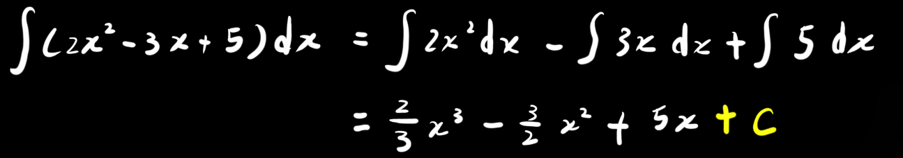
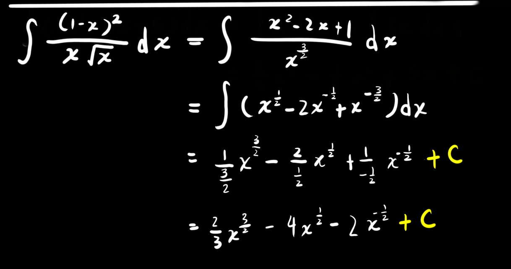

| 导函数                              | 原函数                               |
| ----------------------------------- | ------------------------------------ |
| $\int$$0$ $dx$                      | $c$                                  |
| $\int$$k$$dx$                       | $kx+c$                               |
| $\int$$x^a$$dx$                     | $\dfrac{1}{a+1}x^{a+1}+c$            |
| $\int$$\dfrac1x$$dx$                | $\ln(|x|)+c$                         |
| $\int$$a^x$$dx$                     | $\dfrac{1}{\ln a}a^x+c$              |
| $\int$$e^x$$dx$                     | $e^x+c$                              |
| $\int$$\sin x$$dx$                  | $-\cos x +c$                         |
| $\int$$\cos x$$dx$                  | $\sin x+c$                           |
| $\int$$\sec^2x$$dx$                 | $\tan x+c$                           |
| $\int$$\csc^2x$$dx$                 | $-\cot x+c$                          |
| $\int$$\dfrac{1}{\sqrt{1-x^2}}$$dx$ | $\arcsin x+c$                        |
| $\int$$\dfrac{1}{1+x^2}$$dx$        | $\arctan x+c$                        |
| $\int$$\sec x\tan x$$dx$            | $\sec x +c$                          |
| $\int$$\csc x\cot x$$dx$            | $-\csc x+c$                          |
| $\int \frac{dx}{x^2-a^a}dx$         | $\frac{1}{2a}\ln|\frac{x-a}{x+a}|+c$ |
| $\int \frac{dx}{a^2+x^2}dx$         | $\frac1a \arctan\frac xa+c$          |

例题(简单)：

例题(稍难)：

------

$$
\int \dfrac{x^4}{1+x^2}dx=\int \dfrac{x^4-1+1}{1+x^2}dx=\int\dfrac{(x^2-1)(x^2+1)}{1+x^2}dx+\int \dfrac{1}{1+x^2}dx\\
=\int (x^2-1)dx+\int \dfrac{1}{1+x^2}dx=\dfrac13x^3-x+\arctan x+c
$$

------

$$
\int \cos^2\dfrac x2dx=\int (\dfrac{1+\cos x}{2})dx=\int \dfrac12dx+\int \dfrac{\cos x}{2}dx\\
=\dfrac12x+\dfrac12\sin x+c
$$

------

$$
\int \tan^2xdx=\int (\sec^2x-1)dx=\int \sec^2xdx-\int 1dx=\tan x-x+c
$$

