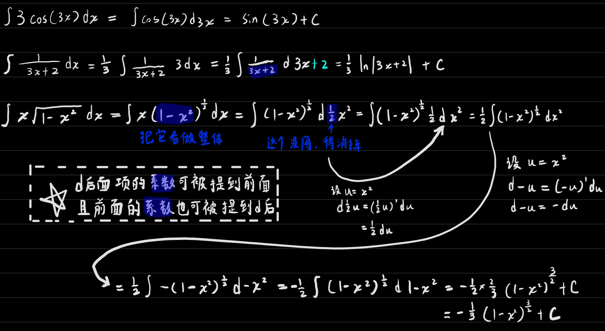
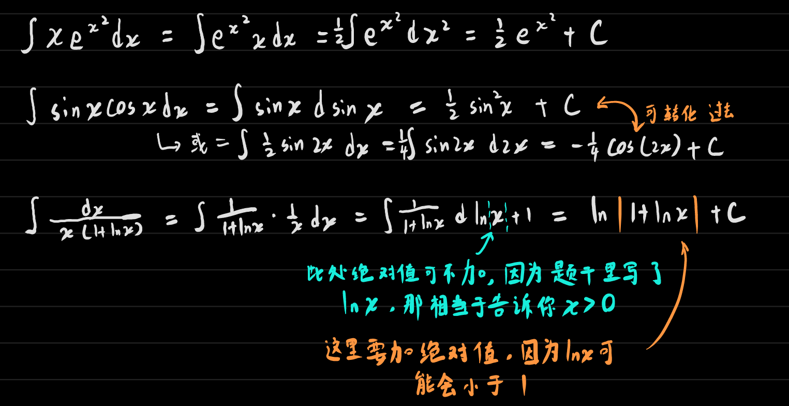
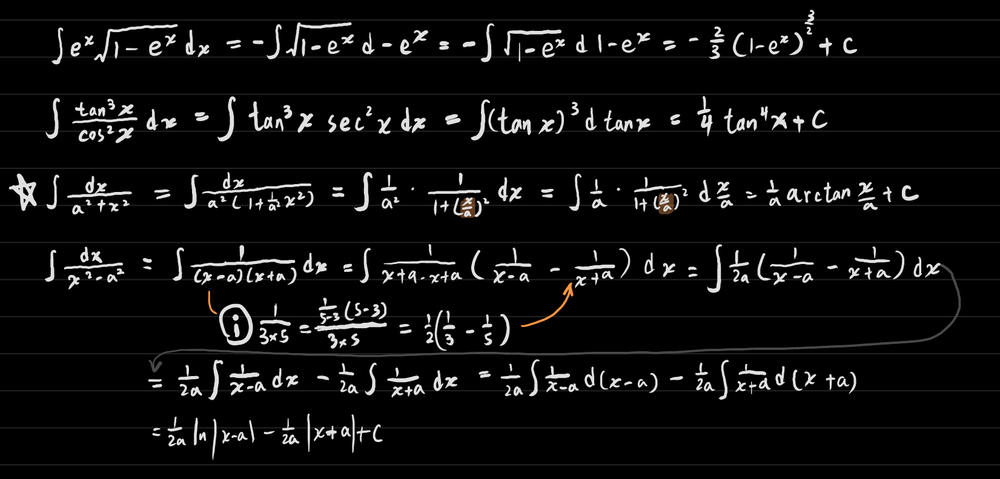
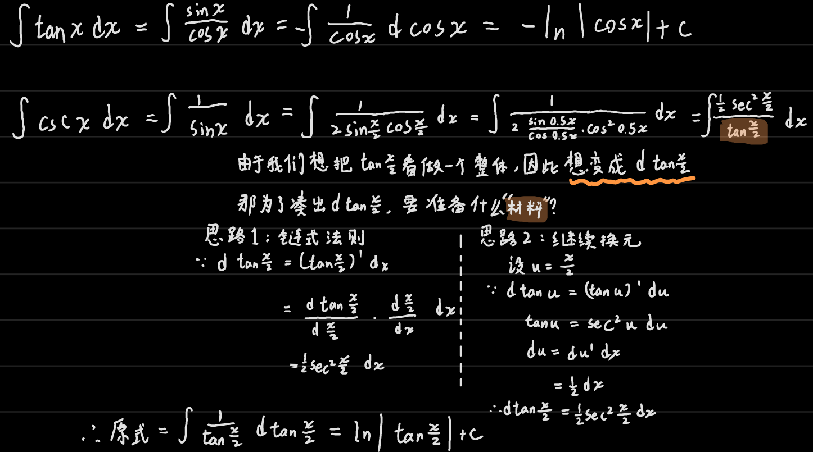
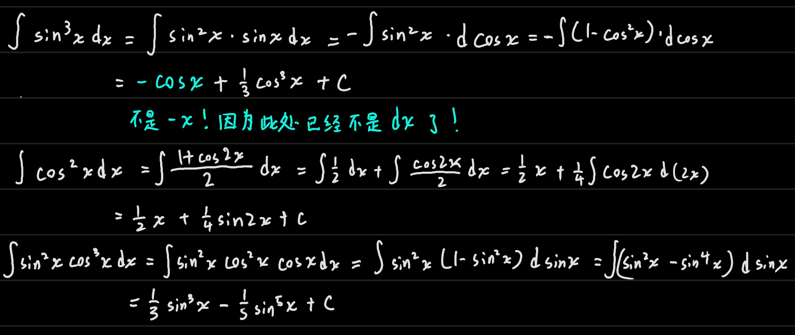

## 第一换元积分法核心（凑）

根据公式 $f'(x)dx=df(x)$

把这个d<u>前面</u>这个"项"，或者叫函数，转成它的==原函数==，然后放到 $d$ 的<u>后面</u>

> 注意所谓的==原函数==可以根据需要适当地加上一个常数

换到后面去以后再想办法把剩下的项凑成基本积分公式所需要的

标准表达：
$$
\int g(x)dx\\
=\int f(\varphi(x))\varphi'(x)dx && 把g(x)分割成两个函数，其中\varphi(x)就是上文中的'什么'，\varphi'(x)就是'什么'的求导\\
=\int f(\varphi(x))d\varphi(x) && 之前提取出'什么'的求导放到d后面就变回了'什么'\\
=\int f(u)du && '什么'原本是一个式子，这里把式子转为了一个变量，以满足标准积分公式的需要\\
=F(u)+c && 套积分公式\\
=F(\varphi(x))+c && 最后换回去
$$

------

总之就是：想方设法把一个复杂的函数

①拆分成很多项。

②化简每一项，并决定把项中的哪一部分看做==整体==时能让整个项符合 [ 常用函数积分 ] ，注意这个==整体==还不能太复杂，它的==导函数==是能被东拼西凑出来的

## 例题

### 基础题型

### 进阶①

### 进阶②

### 三角函数①

### 三角函数②

* 如果d前面的sin或cos是一个奇数次的，那一般就把其中一次放到d后面，那剩下的就是偶数次了。又因为 $\sin^2x+\cos^2x=1$

* 如果都是偶数次的，那就用倍角公式处理，就不要在d后面加上三角函数了

* 还有就是 $d$ 后面的`一次项`和`常数项`是可以==随意生成==的。由于对常数求原函数就是给它来个 $x$ ，那么如果我想要在 $d$ 后面来个 $ax$，那就可以创建一对 $a$ 和 $\dfrac1a$ ， $\dfrac 1a$作为常数可以挪到积分符号外面，$a$ 就可以放到 $d$后面去了，常数项因为求原函数要加 $c$ ，所以也可以随便加。

如：
$$
\int \dfrac{1}{2x+3}dx=\int \dfrac{1}{2x+3}\times\dfrac{1}{2}\times 2dx=\dfrac12\int\dfrac{1}{2x+3}d2x\\
=\dfrac12\int\dfrac{1}{2x+3}d2x+3=\dfrac12 \ln|2x+3|+c
$$
