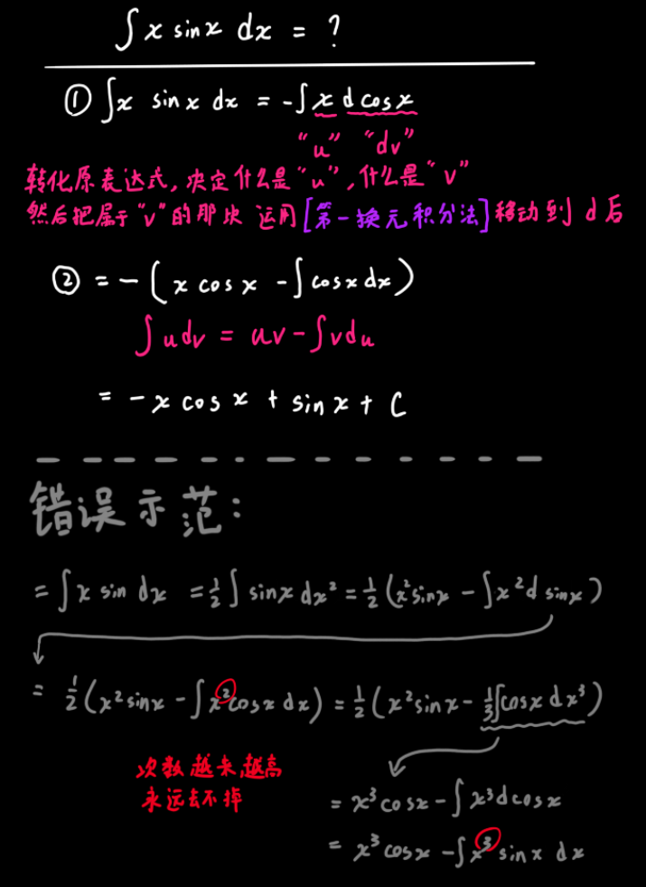

## 核心

$$
(uv)'=u'v+uv'\\
uv'=(uv)'-u'v\\
\int uv'dx=\int (uv)'dx-\int u'vdx\\
\int udv=uv-\int vdu
$$

使用前应注意：决定完谁放在 $d$ 前面时，想一想这么做能让积分的内容==变简单==吗？

规律总结：

* 把==复杂==的东西放在 $d$ `后面`~（因为根据这个规律复杂的待会会被移到d前面）~，把==简单或求导后会变简单==的东西放在 $d$ `前面`~（待会会到d后面）~，肯定是 $\int [复杂] d[简单]$ 比 $\int [简单]d[复杂]$ 好求
* 把高次项放到 $d$ 后面时能降一次，因此通过多次`分部积分`，总能把某些高次项化掉

1. 同时有x和sinx，把sinx挪到d后面，反之x的次数越做越大
2. 挪到d后面的优先级： $e^x、\sin x或\cos x、x^n、\ln x、\arctan x等反三角$
3. 同时有x和lnx，把x挪到d后面，$\ln x$求导后会变简单
4. 同时有x和arctanx/arccotx/arcsinx/arccosx，把x挪到d后面，$\arctan x等$求导后会变简单

## 例题

$$
\int xe^xdx=\int x de^x=xe^x-\int e^xdx=xe^x-e^x+c
$$

------

$$
\int x\ln xdx=\dfrac12\int \ln xdx^2=\dfrac12(x^2\ln x-\int x^2d\ln x)=\dfrac12(x^2\ln x-\int x^2\dfrac1xdx)\\
=\dfrac12(x^2\ln x-\int xdx)=\dfrac12(x^2\ln x-x^2+c)=\dfrac12x^2\ln x-\dfrac12x^2+c\\
$$

------

$$
\int x \arctan x dx=\dfrac12\int \arctan xdx^2=\dfrac12(x^2\arctan x-\int x^2d\arctan x)\\
=\dfrac12(x^2\arctan x-\int \dfrac{x^2}{1+x^2}dx)=\dfrac12(x^2\arctan x-\int \dfrac{1+x^2-1}{1+x^2}dx)\\
=\dfrac12(x^2\arctan x-\int \dfrac{1+x^2}{1+x^2}dx-\int \dfrac{1}{1+x^2}dx)\\
=\dfrac12(x^2\arctan x-x-\arctan x+c)\\
=\dfrac12x^2\arctan x-\dfrac12x-\dfrac12\arctan x+c
$$

------

$$
\int \ln xdx=x\ln x-\int x d\ln x=x\ln x-\int \dfrac xx dx=x\ln x-x+c
$$

------

$$
\int x^2e^xdx=\int x^2de^x=x^2e^x-\int e^x dx^2=x^2e^x-2\int xe^xdx\\
看到这里，应该会觉得这个和前面的错误示范很像，这怎么做了一次分部积分还不行呢?\\
其实是不一样的，这里是x^2变成x，错误示范里的次数是在增加的\\
因此不要放弃，再做一次分部积分\\
=x^2e^x-2\int xde^x=x^2e^x-2(xe^x-\int e^xdx)=x^2e^x-2(xe^x-\int e^xdx)\\
=x^2e^x-2(xe^x-e^x+c)=x^2e^x-2xe^x-2e^x+c
$$

## 只在分部积分法中才会出现的一种[神奇现象]

$$
\int e^x\cos xdx=\int \cos xde^x=e^x\cos x-\int e^xd\cos x=e^x\cos x-\int e^x\sin x dx\\
这里看似也没有后路了，但是不要放弃\\
=e^x\cos x-\int\sin xde^x=e^x\cos x-e^x\sin x+\int e^xd\sin x\\
=e^x\cos x-e^x\sin x+\int e^x\cos xdx\\
这里看似绕了一圈绕回来了，但实则是柳暗花明又一村\\
\int e^x\cos xdx=e^x\cos x-e^x\sin x+\int e^x\cos xdx\\
2\int e^x\cos xdx=e^x\cos x-e^x\sin x\\
\int e^x\cos xdx=\dfrac{e^x\cos x-e^x\sin x}{2}\\
本来是递等式的问题，变成了方程问题
$$

即在计算积分式时，$\int f(x) dx=g(x)+k\int f(x) dx$，原式的内容又出现了，当 $k\neq1$ 时都不用担心，只要把右边的移动到左边，然后除一下就行。当 $k=1$，时不是题目有误，只能说：你算错了 (o_O)
