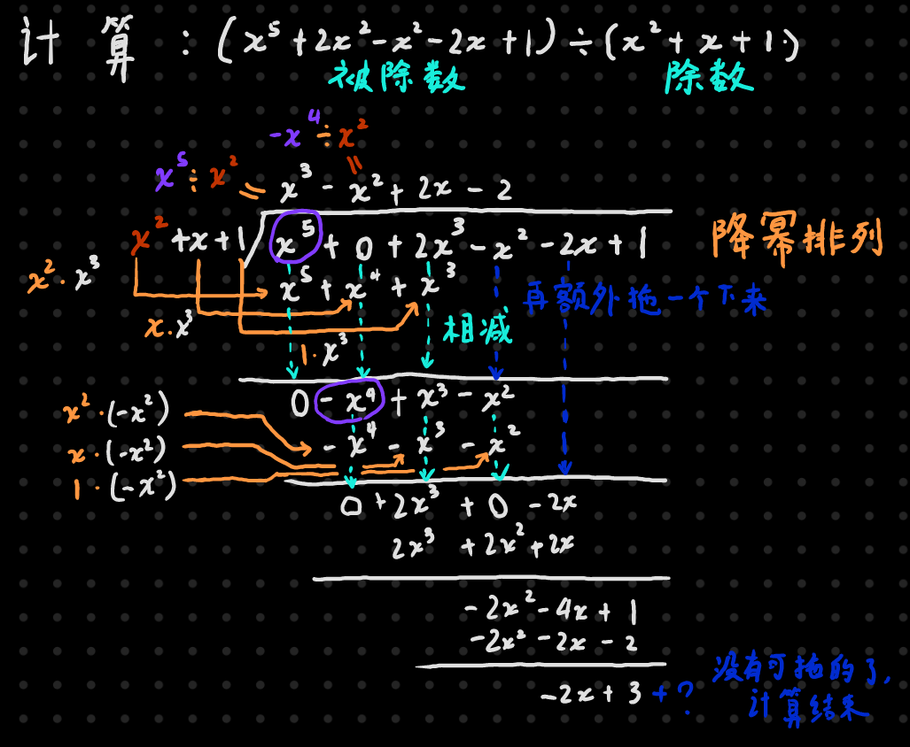

## 真分数与真分式

`真分数`的“真”是“真实”的意思。真分数是指大于0小于1的所有分数。这些分数的特点是“分母==大于==分子”

若分子==大于或等于==分母，即`假分数`，那必定可以从中提取出一个整数和一个真分数如 $\dfrac98=1+\dfrac18$

而`真分式`的定义和真分数类似，指分式中分子的最高次数==小于==分母的最高次数。

`假分式`中分子的最高次数==大于或等于==分母的最高次数。假分式可以通过`多项式除法`从中提取出一个整式和一个真分式（注意分子分母次数相同的假分式可以通过 [附2] 的方法简便计算，比用多项式除法方便）

## 对真分式(二次)求积分，分为几种情况

1. 分子为常数的真分式，分子是二次的，如$\int \dfrac{1}{ax^2+bx+c}dx$ ，此情况又分为三种子情况

   > 注：下方的例题为了方便解释都是二次项系数为1的，可实际做题不会这么理想啊，没关系
   >
   >  $\int \dfrac{1}{ax^2+bx+c}dx可化为a\int\dfrac{1}{x^2+\frac bax+\frac bac}dx$，可变成二次项系数为1的样子，

   1. $ax^2+bx+c=0$ 有两个相同的根时，说明此多项式可被化为 $(x-q)^2$ 的形式，此时积分最好做。

      如 $\int \dfrac{2}{x^2+4x+4}dx=2\int\dfrac{1}{(x+2)^2}dx=2\int\dfrac{1}{(x+2)^2}d(x+2)=-2(x+2)^{-1}+c$  

      注意上面，最后一步带积分符号别用成 $\ln$ 了，虽然 $(x+2)^2$ 在分母上，但是 $d$ 后面是 $(x+2)$ 不是 $(x+2)^2$

   2. $ax^2+bx+c=0$ 有两个==不==相同的根时，说明此多项式可被化为 $(x-x_1)(x-x_2)$ 的形式，这种情况也有固定的解题格式，如：
      $$
      \int \dfrac{1}{x^2-5x+6}dx=\int \dfrac{1}{(x-2)(x-3)}dx\\
      我们知道上面这个式子一定是能通过某种方法转变成下面这种的，但是系数不知道，因此待定(即待定系数法)\\
      =\int(\dfrac{A}{x-2}+\dfrac{B}{x-3})dx\\
      =\int(\dfrac{A(x-3)+B(x-2)}{(x-2)(x-3)})dx\\
      =\int(\dfrac{Ax-3A+Bx-2B}{(x-2)(x-3)})\\
      由此可得:
      \left\{\begin{aligned}
      A+B=0(x本不应该存在,因此两个的x系数应互相抵消)\\
      -3A-2B=1(常数项的和应等于1,即像原本的式子一样)\\
      \end{aligned}\right.\\
      解得A=-1,B=1\\
      原式=\int(\dfrac{-1}{x-2}+\dfrac{1}{x-3})dx\\
      =\int\dfrac{-1}{x-2}dx+\int\dfrac{1}{x-3}dx\\
      =-\int\dfrac{1}{x-2}d(x-2)+\int\dfrac{1}{x-3}d(x-3)\\
      =-\ln|x-2|+\ln|x-3|+c=\ln|\dfrac{x-3}{x-2}|+c
      $$

   3. $ax^2+bx+c=0$ 没有实根，说明只能化成 $(x+q)^2+p$ 的形式（即$(x+q)^2=-p$嘛，负数开方无实根）。也有通用做法（配方+将配出来的常数变成1+第一换元凑成arctan的积分式子），如：
      $$
      \int\dfrac{1}{x^2+2x+5}dx=\int\dfrac{1}{(x+1)^2+4}dx(进行配方)=\int\dfrac{1}{4(\frac14(x+1)^2+1)}d(x+1)\\
      =\dfrac14\int\dfrac{1}{(\frac{x+1}{\sqrt4})^2+1}d(x+1)=\dfrac12\int\dfrac{1}{(\frac{x+1}{2})^2+1}d(\dfrac{x+1}{2})\\
      =\dfrac12\arctan\dfrac{x+1}{2}+c
      $$

2. 分子为1次的，分母为2次的，如 $\int \dfrac{fx+e}{ax^2+bx+c}dx$ ，此情况又分为三种子情况。

   > 跟上面一样，$\int \dfrac{fx+e}{ax^2+bx+c}dx$ 可化为 $f\times a\int \dfrac{x+\frac ef}{x^2+\frac bax+\frac bac}$
   >
   > 最高次项系数为1好考虑

   1. 两个一样的根，把分子配成和分母一样的，然后拆开，例
      $$
      \int \dfrac{x+2}{(x+1)^2}dx=\int  \dfrac{(x+1)+1}{(x+1)^2}dx=\dfrac{x+1}{(x+1)^2}d(x+1)+\dfrac{1}{(x+1)^2}d(x+1)
      $$

   2. 两个不一样的根，还是使用待定系数法，例
      $$
      \int \dfrac{x+6}{(x-1)(x-2)}dx=\int(\dfrac{A}{x-1}+\dfrac{B}{x-2})dx=\int\dfrac{Ax-2A+Bx-B}{(x-1)(x-2)}dx\\
      \left\{\begin{aligned}
      A+B=1\\
      -2A-B=6\\
      \end{aligned}\right.\\
      A=-7,B=8\\
      =\int(\dfrac{-7}{x-1}+\dfrac{8}{x-2})dx后面就不用解释了吧
      $$
   
   3. 没有实数根，还是最麻烦的情况，设分母的二次多项式为 $rx^2+kx+q$ ，
   
      从分子中抠出来一个 $x-b$，然后把 $x-b$ 放到 $d$ 后面，$b$ 应==满足 $b=k/2$== （因为 d 后面必然有一个 $\frac12x^2$，系数是分母多项式二次项的一半，那一次项的系数也得是一半啊，所以等于 $k/2$）
      $$
      \int\dfrac{x+6}{x^2-2x+3}dx=\int\dfrac{x-1}{x^2-2x+3}dx+\int\dfrac{7}{x^2-2x+3}dx\\
      =\int\dfrac{d(\frac12x^2-x)}{x^2-2x+3}+7\int\dfrac{1}{x^2-2x+3}dx\\
      =\dfrac12\int\dfrac{d(x^2-2x)}{x^2-2x+3}+7\int\dfrac{1}{x^2-2x+3}dx(把那\frac12提出去)\\
      =\dfrac12\int\dfrac{d(x^2-2x+3)}{x^2-2x+3}+7\int\dfrac{1}{x^2-2x+3}dx\\
      =\dfrac12\ln|x^2-2x+3|+7...(后面这块变得和上面那种子情况一样了，参照上面继续做就行)\\
      $$
      

## 附1：多项式除法~（这不比综合除法强？）~

$$
最终答案:(x^5+2x^3-x^2-2x+1)\div(x^2+x+1)=x^3-x^2+2x-2\cdots\cdots-2x+3\\
即(x^5+2x^3-x^2-2x+1)=(x^2+x+1)\times(x^3-x^2+2x-2)+(-2x+3)\\
等式两边再同除除数可得:不用\cdots表示余数的商\\
(x^5+2x^3-x^2-2x+1)\div(x^2+x+1)=x^3-x^2+2x-2+\dfrac{-2x+3}{x^2+x+1}
$$

## 附2：怎么做同次多项式的除法

$$
\dfrac{x^2+5}{2x^2+3x-6}=\dfrac{(x^2+\frac32x-3)-\frac32x+8}{2x^2+3x-6}\\
为了把那个二次项消掉，需要把分子配成跟分母一样或差个系数\\
=\dfrac12+\dfrac{-\frac32x+8}{2x^2+3x-6}
$$

