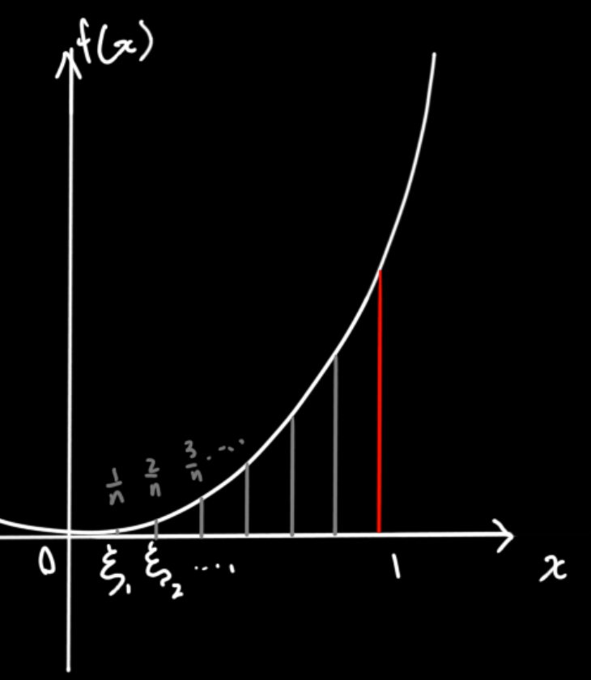

## 引出：曲边梯形的面积

定义$f(x)$在$[a,b]$上有界，在$[a,b]$上任意插入任意分点，分成$n$个小区间，$\triangle x_1,\triangle x_2,\triangle x_3...\triangle x_n$，在每个小区间上任取一点 $\xi _i$，取该点的函数值 $f(\xi_i)$，最后
$$
\lim_{\lambda\to 0}\sum_{i=1}^nf(\xi_i)\triangle x,令\lambda=\max({\triangle x_1,\triangle x_2...\triangle x_n})\\
即最大的趋于0，那每个都趋于0，这样小区间就被分为了无穷多个，并且每个都是无穷小\\
若上述极限存在，则记作:\\
\int_a^bf(x)dx
$$

$$
f(x)是被积函数，f(x)dx是被积表达式，x是积分变量，a是积分下限，b是积分上限
$$

> 因此，关于积分的定义可以有两种解释，第一就是当 $f(x)$ 代表的是一个==导函数==时，积分出来的变量是一个这个导函数的==原函数==。当 $f(x)$ 本身就代表一个普通的函数时，再对它进行积分得到的就是这个函数与$x$轴围成的==图像面积==

* 注意：积分积出来的值只与 $f(x)$ 和积分区间有关系，与积分变量==没有关系==。

## 何时可做积分

1. 函数在区间上连续，则函数在该区间上可求定积分

2. 若函数（的函数值）是有界的，且有==有限==个间断点，则此函数可积

## 定积分的性质

$$
\int_a^b1dx=b-a
$$

------

$$
\int_a^bf(x)dx=-\int_b^af(x)dx
$$

------

$$
\int_a^b(\alpha f(x)+\beta g(x))dx=\alpha\int_a^b f(x)dx+\beta\int_a^bg(x)dx
$$

------

$$
\star\ \ \int_a^bf(x)dx=\int_a^cf(x)dx+\int_c^bf(x)dx
$$

> 如何解释这个结论的几何意义？
>
> 情况1：$a<b<c$
>
> 
>
> 情况2：$a<b<c$
>
> 
>
> 由此可见不管c 在$[a,b]$中还是外边，都可以解释，所以上面的公式没有指定 c 在 

------

$$
当f(x)\ge0时，\int_a^bf(x)dx\ge0\\
$$

$$
推论1：f(x)\le g(x)时，g(x)-f(x)\ge0，\int_a^bg(x)-f(x)dx\ge 0\\
\int_a^bg(x)dx-\int_a^bf(x)dx\ge 0\\
\int_a^bf(d)dx\le \int_a^b g(x)dx\\
$$

$$
推论2：|\int_a^bf(x)dx|\le\int_a^b|f(x)|dx\\
f(x)很有可能有正有负，根据积分定义，那肯定正的部分和负的部分有些是抵消的。\\
如果先求绝对值，把负的那部分全部给翻到正了，再求绝对值，那肯定比正负有的抵消了的来的大
$$

------

$$
介值定理:\\
若有区间[a,b]，m是该区间内函数的最小值，M是该区间内函数的最大值\\
则m(b-a)\le\int_a^bf(x)dx\le M(b-a)
$$

$$
函数的积分值介于\ 红色方块\ 面积和\ 绿色方块\ 面积之间
$$

------

$$
\star\ \ 定积分中值定理\\
若f(x)连续，\int_a^bf(x)dx=f(\xi)(b-a)，a\le\xi\le b\\
如下图，我们一定可以找到一点\xi，使得下面那个长方形的面积等于函数在区域内的面积\\
\xi的值除了有上述作用外,f(\xi)还是f(x)在[a,b]区间内的<平均值>
$$

> 可根据介值定理推得
> $m(b-a)\le\int_a^bf(x)dx\le M(b-a)\\$
>
> $m\le\dfrac{1}{b-a}\int_a^bf(x)dx\le M\\
> $
>
> 中间这个表达式看似复杂，但本质上是一个确定的数，它介于m与M
> 根据《函数-连续函数运算法则-介值性》
>
> 总可以找到一点 $\xi$，使得 $f(\xi)=\dfrac{1}{b-a}\int_a^bf(x)dx$
>
> 上式化简过来就是 $\int_a^bf(x)dx=f(\xi)(b-a)$

## 利用定积分的定义求函数的面积

$$
\int_0^1 x^2dx\\
我们把[0,1]分成n份，则每份的长度\triangle x=\dfrac1n\\
则假设\xi_i=\dfrac in\\
A=\sum_{i=1}^nf(\xi_i)\triangle x=\sum_{i=1}^n(\dfrac in)^2\cdot \dfrac1 n=\sum_{i=1}^n\dfrac{i^2}{n^3}=\dfrac{1}{n^3}\sum_{i=1}^ni^2\\
=\dfrac{1}{n^3}\cdot\dfrac16n(n+1)(2n+1)(后面这些是套公式得到的，不用管他)\\
=\dfrac{n(n+1)(2n+1)}{6n^3}\\
上面的近似面积随着n取值的增大不断趋近于真实面积，那当n趋近于无限时就是真实面积\\
\lim_{x\to \infty}\dfrac{n(n+1)(2n+1)}{6n^3}\\
分母求极限，当上下最高次数相同时，极限值取最高次项的系数之比\\
=\dfrac13
$$
