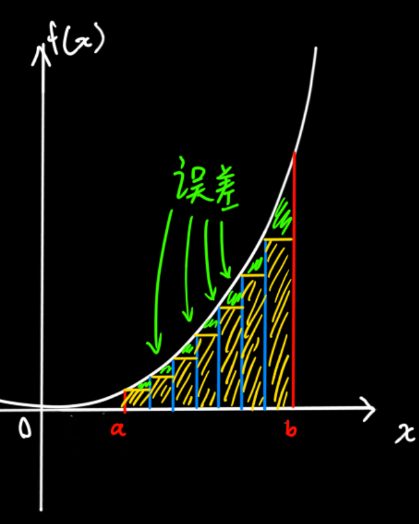
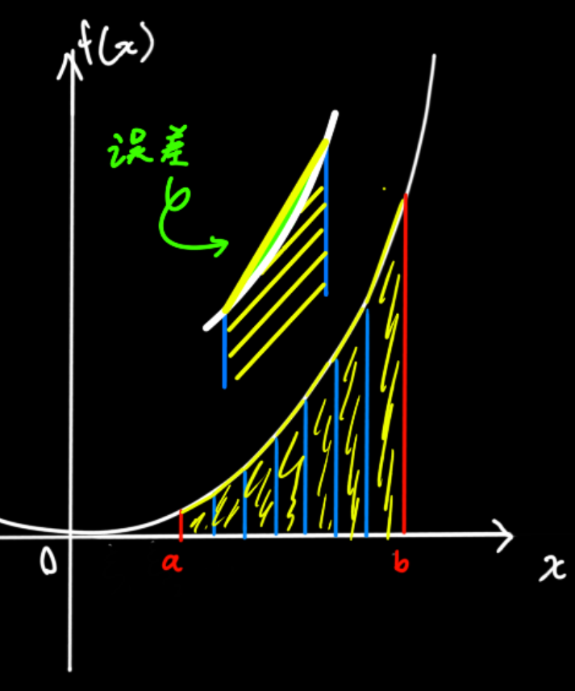
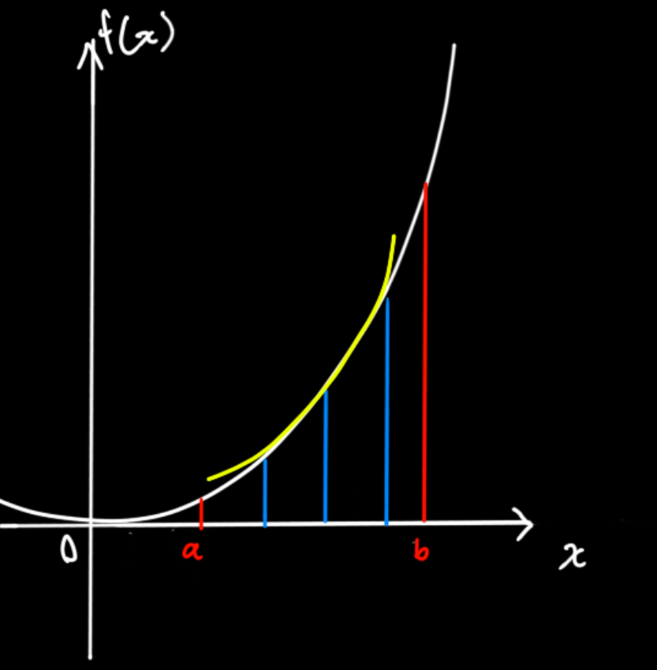

## 近似计算

1. 矩形法（可以看到绿色的误差区域还是挺大的）

2. 梯形法（刚才只是取矩形，现在是根据左右函数值画一个梯形，误差就小的几乎看不见了）

> 梯形面积：（上底+下底）\* 高 / 2

$$
A=\dfrac{b-a}{n}\dfrac{y_0+y_1}{2}+\dfrac{b-a}{n}\dfrac{y_1+y_2}{2}+...+\dfrac{b-a}{n}\dfrac{y_{n-1}+y_n}{2}+\\
=\dfrac{b-a}{n}(\dfrac{y_0+y_1}{2}+\dfrac{y_1+y_2}{2}+...+\dfrac{y_{n-1}+y_n}{2})\\
=\dfrac{b-a}{n}(\dfrac{y_0+y_n}{2}+y_1+y_2+...+y_{n-1})
$$

3. 抛物线法

简单来说就是过三点拟合一条二次函数，然后再对二次函数求其中两点间的积分值

