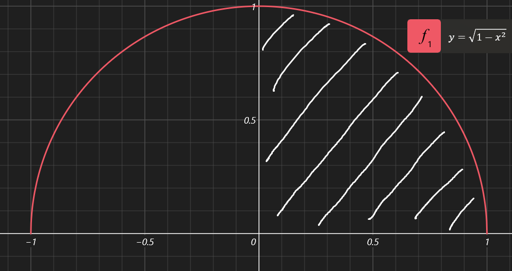

# 核心公式

定积分换元和不定积分换元有两处不同：（假设换成的变量名为$x,x=\varphi(t),t=g(x)$）

1. 定积分换元时上下限也要跟着换，设原上限为$a$，则转换后的上限为 $g(a)$，别套到 $\varphi(t)$ 里去了
2. 原式中 $x$ 的表达式换成 $t$ 的表达式后直接将积分上下限带入即可，不用再换回 $x$了 
3. 这个换元函数 $\varphi(t)$ 在 $[a,b]$ 区间上必须要是**单调**的，且必须有连续的导数

原变量的==积分下限==对新变量的==积分下限==；原变量的==积分上限==对新变量的==积分上限==
$$
\int_a^bf(x)dx=\int_\alpha^\beta f(\varphi(t))\varphi'(t)dt\\
$$

## 例子

$$
\int_0^8\dfrac{1}{1+\sqrt[3]x}dx\\
解:设t=\sqrt[3]x\\
则x=t^3,dx=3t^2dx\\
x从0到8，t从\sqrt[3]0到\sqrt[3]8，即0到2\\
\because x=t^3是一个增函数\\
\therefore 原式=\int_0^2\dfrac{3t^2dt}{1+t^2}=3\int_0^2\dfrac{t^2dt}{1+t^2}=3\int_0^2\dfrac{t^2-1+1dt}{1+t^2}\\
=\int_0^2(t-1+\dfrac{1}{t+1})dt=\dfrac12t^2-t+\ln|t+1|\ \ |_0^2\\
=2-2+\ln(3)-\ln(1)
$$

------

$$
\int_0^a\sqrt{a^2-x^2}dx,a>0\\
解: 设x=a\sin t，则t=\arcsin(\dfrac xa),dx=a\cos t\\
x从0到a，那t从\arcsin(\dfrac 0a)到\arcsin(\dfrac aa)，即从0到\dfrac\pi2\\
\because x=a\sin t在0\le t\le \dfrac\pi2时单调递增\\
\therefore=\int_0^\frac\pi0\sqrt{a^2-a^2\sin^2t}a\cos tdt\\
=a\int_0^\frac\pi0\sqrt{1-\sin^2t}a\cos tdt\\
=a\int_0^\frac\pi0\sqrt{\cos^2t}a\cos tdt\\
=a\int_0^\frac\pi0\cos t a\cos tdt\\
=a^2\int_0^\frac\pi0\cos^2 t dt\\
=a^2\int_0^\frac\pi0\dfrac{1+\cos 2t}{2} dt\\
=\dfrac14\pi a^2
$$

> 为什么这道题的结论很重要？
>
> 假设 $y=\sqrt{a^2-x^2}$，则$y^2+x^2=a^2$，可以发现这就是圆的方程。
>
> 为了方便理解，把常数a设为1，下图是 $y=\sqrt{1-x^2}$ 时函数的图像
>
> 
>
> 如果想求阴影部分面积，有两种方法
>
> 1. 因为该函数描述的是个半圆，阴影部分面积是 $\dfrac14$ 个圆，可以直接使用圆的面积公式乘$\dfrac14$ $S=\dfrac14\pi r^2=\dfrac14\pi$
>
> 2. 当把阴影部分面积看做是函数与定积分的问题时，阴影面积 $=\int_0^1\sqrt{1-x^2}$
>
>    带入上一题得到的结论，得 $\int_0^1\sqrt{1-x^2}=\dfrac14\pi 1^2=\dfrac 14\pi$
>
> 由此可发现这道题就是在用积分的原理推得了==圆的面积公式==！

------

$$
证明:\int_0^{\frac\pi2}\sin^n xdx=\int_0^{\frac\pi2}\cos^n xdx\\
令x=\dfrac\pi 2-t(因为涉及\sin与\cos 的转换，那整个\dfrac\pi2还是很有必要的)\\
则dx=-dt,t=\dfrac\pi 2-x\\
x从0到\dfrac\pi 2，则t从\dfrac\pi 2到0\\
\int_0^{\frac\pi2}\sin^n xdx=-\int^0_{\frac\pi2}\sin^n (\dfrac\pi 2-t)dt=\int_0^{\frac\pi2}\sin^n (\dfrac\pi 2-t)dt\\
=\int_0^{\frac\pi2}\cos^n tdt\\
\because 积分与被积变量无关,x可直接换为t\\
=\int_0^{\frac\pi2}\cos^n xdx
$$

> 注：这里可以直接把 $x$ 换成 $t$ 是因为这一题的目标只是在比较两个积分表达式。而积分表达式内的积分变量可以是任意未知数或函数。
>
> 但是如果是要你求一个函数的积分值，然后使用换元法做，需要把积分符号 $\int$ 去掉的时候，就别把积分变量换回 $x$ 了，这样肯定会引起歧义的！！

------

$$
设f(x)连续，已知\int_0^xtf(x-t)dt=1-\cos x，求\int_0^{\frac\pi 2}f(x)dx\\
解: 令u=x-t，则t=x-u\\
下面先将x看做是常量\\
t取值范围是从0到x，则u从x到0\\
dt=-du\\
\therefore原式=-\int_x^0(x-u) f(u)du=\int^x_0(x-u) f(u)du\\
=\int^x_0xf(u)du-\int^x_0uf(u)du\\
=x\int^x_0f(u)du-\int^x_0uf(u)du\\
(x\int^x_0f(u)du-\int^x_0uf(u)du)'=(1-\cos x)'\\
(x\int^x_0f(u)du)'-(\int^x_0uf(u)du)'=(1-\cos x)'\\
\because (uv)'=u'v+uv'\\
\int^x_0f(u)du+x\cdot f(x)-xf(x)=0-(-\sin x)\\
\int^x_0f(u)du=\sin x\\
设x=\dfrac\pi2\\
\therefore \int_0^{\frac\pi 2}f(x)dx=\sin \dfrac\pi2=1
$$
