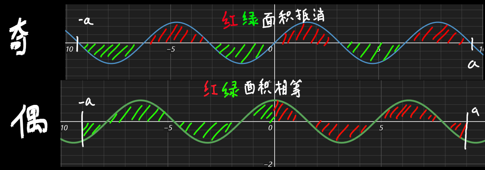

# 核心公式

$$
f(x)为偶函数,\int_{-a}^af(x)dx=2\int_0^af(x)dx\\
f(x)为奇函数,\int_{-a}^af(x)dx=0\\
图像理解也很简单直白\\
$$

> 这个性质直接使用的机会不是很多，通常情况下是把一个积分表达式中的一部分扣出来，扣出来的这部分是个奇函数，可以去掉，剩下一个简化过后的表达式

## 例子

$$
\int_{-1}^1\dfrac{\sin^3x+\arctan^2x}{1+x^2}dx\\
=\int_{-1}^1\dfrac{\sin^3x}{1+x^2}dx+\int_{-1}^1\dfrac{\arctan^2x}{1+x^2}dx\\
(\sin^3x:奇函数^3=偶函数*奇函数=奇函；1+x^2:偶函数；\dfrac{奇函数}{偶函数}=奇函数，其余以此类推)\\
=\int_{-1}^1\dfrac{\arctan^2x}{1+x^2}dx\\
=2\int_0^1\dfrac{\arctan^2x}{1+x^2}dx\\
=2\int_0^1\arctan^2xd\arctan x\\
=\dfrac23\arctan^3x|^1_0\\
=\dfrac{\pi^3}{96}\approx0.32298
$$
