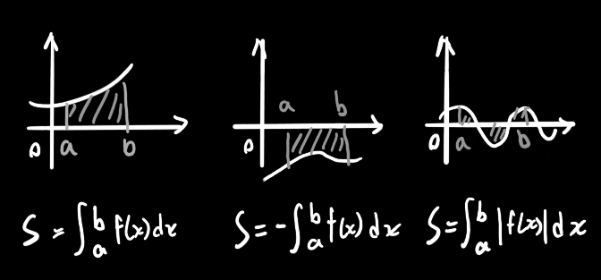
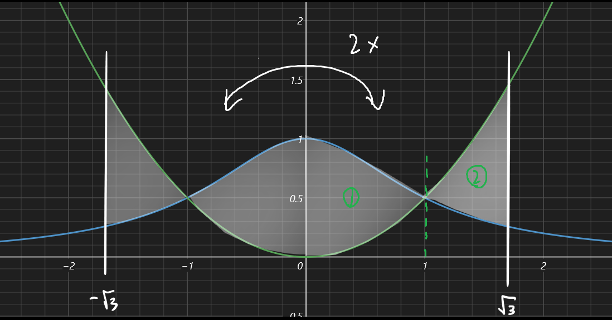

## 例1：(如果上下函数交换位置要分区间)

求 $y=\dfrac{1}{1+x^2}$ 与 $y=\dfrac{x^2}{2}$ 在 $[-\sqrt3,\sqrt3]$上函数间围成的面积

$$
由于以上两个函数都是偶函数，所以只用算一半就行。并且其中一半的面积\\
S=2\times[\int_0^1(\dfrac{1}{1+x^2}-\dfrac{x^2}2)dx+\int_1^\sqrt{3}(\dfrac{x^2}{2}-\dfrac{1}{1+x^2})dx]
$$
