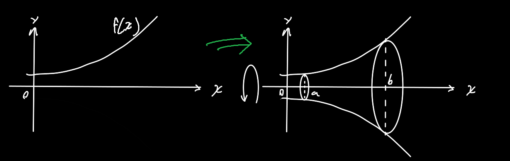
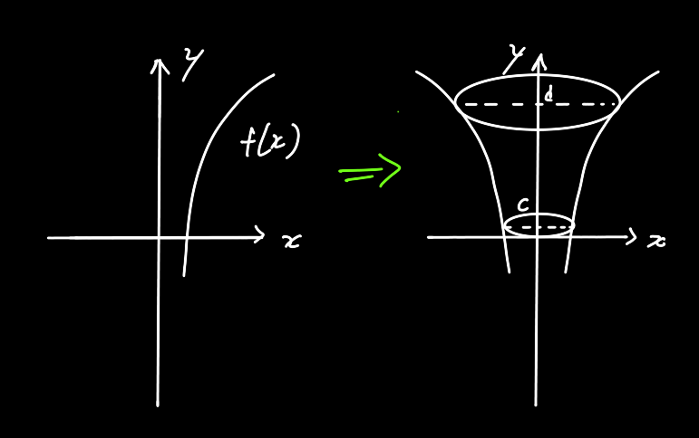

对于不规则形状，它的体积 $V=\int_a^bA(x)dx$ 

## 类型1：x轴旋转体

假如有这么一个函数 $y=f(x)$，把它绕着x轴旋转360度，求a到b之间的体积

$$
V=\int_a^b \pi (f(x))^2dx
$$

## 类型2：y轴旋转体

$$
1.先把y=f(x)写成x=g(y)的形式\\
注:g(x)与f(x)互为反函数，y=f(x)与x=g(y)图像相同，y=f(x)与y=g(x)图像关于y=x对称\\
V=\int_c^d\pi(g(y))^2dy
$$
