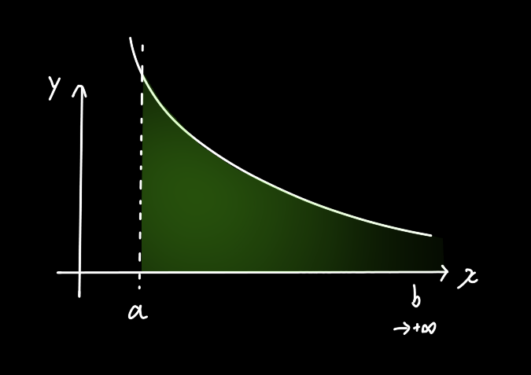
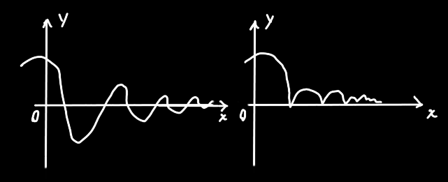

正常的积分是对有限的区域内做积分，当积分上/下限趋近于无限时，怎么计算图像的面积呢？

#### 第一种：上限是正无穷

$$
\int_a^{+\infty}f(x)dx=\lim_{b\to+\infty}\int_a^bf(x)dx
$$

如果极限存在，则称之为`收敛`，否则（周期函数、负无穷或正无穷）称为`发散`

#### 第二种：下限是负无穷

$$
\int_{-\infty}^bf(x)dx=\lim_{a\to-\infty}\int_a^bf(x)dx
$$

#### 第三种：都无穷

$$
\int_{-\infty}^{+\infty}f(x)dx=\int_{-\infty}^cf(x)dx+\int_c^{+\infty}f(x)dx\\
=\lim_{a\to-\infty}\int_a^cf(x)dx+\lim_{b\to+\infty}\int_a^cf(x)dx
$$

## 性质

1. 若 $\int_a^{+\infty}f(x)dx$ 收敛，则 $\int_a^{+\infty}kf(x)dx$ 也收敛

2. 若 $\int_a^{+\infty}f(x)dx$ 与 $\int_a^{+\infty}g(x)dx$ 都收敛，则 $\int_a^{+\infty}(f(x)\pm g(x))dx$ 也收敛，==反之不一定成立==

3. $f(x)\ge0且\int_a^{+\infty}f(x)dx收敛$ <=> $p(x)=\int_a^xf(t)dt$有界 

4. ☆☆☆当 $0\le f(x)\le g(x)$ 时，有：

   $\int_a^{+\infty}g(x)dx$ 收敛，则$\int_a^{+\infty}f(x)dx$也收敛，（可理解为：比瘦子还瘦，还是瘦子）

   $\int_a^{+\infty}f(x)dx$ 发散，则$\int_a^{+\infty}g(x)dx$也发散，（可理解为：比胖子还胖，那不也是胖子）

   > 为甚么 $\ge0$ 的条件很重要？假如没有这个条件：
   >
   > $\int_a^{+\infty}g(x)dx$ 收敛时，$\int_a^{+\infty}f(x)dx$可能朝着 $-\infty$ 发散
   >
   > $\int_a^{+\infty}f(x)dx$ 发散，可能是朝着 $-\infty$ 发散的，因此 $\int_a^{+\infty}g(x)dx$ 可能朝任意一个常数收敛

   

## 例题：能直接算出极限值，然后判断敛散性

$$
\int_0^{+\infty}e^{-x}dx=\lim_{b\to+\infty}\int_0^b e^{-x}dx=\lim_{b\to+\infty}-e^{-x}|_0^b\\
=\lim_{b\to+\infty}-e^{-b}+1=\lim_{b\to+\infty}-\dfrac1{e^b}+1=1，收敛
$$

$$
\int_{-\infty}^{+\infty}\dfrac{dx}{1+x^2}=\arctan x|^{+\infty}_{-\infty}=\pi/2-(-\pi/2)=\pi，收敛
$$

$$
\int_0^{+\infty}\cos xdx=\sin x|_0^{+\infty}=周期性函数无极限，发散
$$

## 例题：利用性质4间接判断

$$
求\int_0^{+\infty}e^{-x^2}dx敛散性\\
这个求原函数不是很方便，因此选一个简单点的函数e^{-x}与它进行比较\\
(当然e^{-x^2}和e^{-x}都是大于0的，因此可以用性质4判断)\\
首先把原式拆成两部分:\int_0^{+\infty}e^{-x^2}dx=\int_0^1e^{-x^2}dx+\int_1^{+\infty}e^{-x^2}dx\\
至于为什么这么拆，因为e^{-x^2}只在x>1时比e^{-x}小\\
下一步就是严格证明\ e^{-x^2}比e^{-x}小了:\\
\because 当x\ge1时x^2\ge x\\
\therefore -x^2\le x\\
\therefore e^{-x^2}\le e^{-x}\\
因为\int_0^1e^{-x^2}dx是个常数，存不存在不影响敛散性的计算\\
因此最后一步只要证明\int_1^{+\infty}e^{-x^2}dx是收敛的:\\
\int_1^{+\infty}e^{-x}dx=\lim_{b\to+\infty}\int_1^b e^{-x}dx=\lim_{b\to+\infty}-e^{-x}|_1^b\\
=-\dfrac{1}{e^x}+\dfrac1e=\dfrac1e\\
综上所述，\int_0^{+\infty}e^{-x^2}dx收敛
$$

## 绝对收敛和条件收敛

$\int_a^{+\infty}f(x)dx$ 收敛，且 $\int_a^{+\infty}|f(x)|dx$ 也收敛，此时称 $\int_a^{+\infty}f(x)dx$ `绝对收敛`

$\int_a^{+\infty}f(x)dx$ 收敛，但 $\int_a^{+\infty}|f(x)|dx$ 发散，此时称 $\int_a^{+\infty}f(x)dx$ `条件收敛`

#### 定理

绝对收敛必收敛，即若 $\int_a^{+\infty}|f(x)|dx$ 证明出来是收敛的，那么没取绝对值时 $\int_a^{+\infty}f(x)dx$ 必定也是收敛的

>  因为给函数加绝对值的作用就像给交流电加全桥整流，负的部分全部按x轴翻转到上面去。原本的函数有正有负，面积部分抵消，肯定比加绝对值后积分面积小一些。$\int_a^{+\infty}|f(x)|dx\ge \int_a^{+\infty}f(x)dx$
>
> 既然大的都能收敛，那么小的肯定也能收敛。

严格证明：
$$
\because 0\le |f(x)|-f(x)\le 2|f(x)|\\
(简要理解上述公式:当f(x)>0时0\le0\le2f(x)，当f(x)<0时0\le-2f(x)\le-2f(x))\\
又\because 已知|f(x)|收敛\\
(这边不太懂:\int_a^{+\infty}|f(x)|dx收敛等于|f(x)|收敛?)\\
\therefore|f(x)|-f(x)也收敛(性质4)\\
\because f(x)=|f(x)|-(|f(x)|-f(x))\\
根据性质2，收敛函数相加减，得到的也收敛\\
因此f(x)收敛
$$
