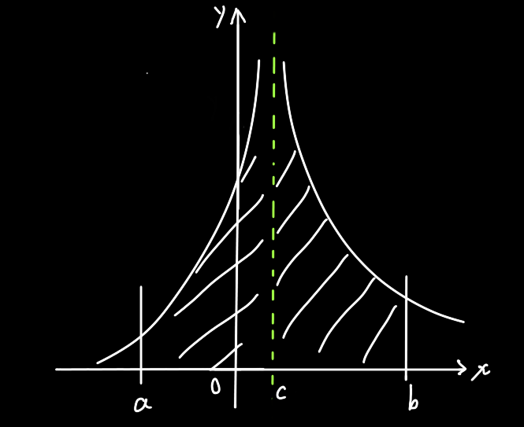

## 情况1

当 $f(x)$ 在b处没有极限，或者说在b处有垂直渐近线，但是又要求a到b的积分值，此时称为瑕积分

那么怎么解决呢？

题目是要求求a到b之间的积分值，但是显然在b处取不到值，那么积分上限就不要取b，取一个b往左偏移一点的数。

假设偏移的距离为 $\epsilon^+$ ，那么如果下面这个极限存在，则原先 $\int_a^bf(x)dx$ 这个积分也是存在的
$$
\int_a^bf(x)dx=\lim_{\epsilon\to0^+}\int_a^{b-\epsilon}f(x)dx
$$

## 情况2

$$
\int_a^bf(x)dx=\lim_{\epsilon\to0^+}\int_{a+\epsilon}^bf(x)dx
$$

## 复合型

这种把它拆成上面两种分别计算就行了

> 注意在用换元法做瑕积分的时候，别指望能把那个"瑕点"给替换掉 : (

## 例题

瑕积分的题目一般不会告诉你"我是瑕积分"，它看起来就是一个正常的定积分题目，因此要不要用瑕积分的方法去做是要你自己去判断的。
$$
\int_0^1\ln x dx\\
根据\ln图像或者对数函数的定义域，可知x=0时取不到极限，因此这是一道瑕积分\\
=\lim_{\epsilon^+\to0}\int^1_{0+\epsilon}\ln xdx\\
=\lim_{\epsilon^+\to0}\int^1_{\epsilon}\ln xdx\\
根据《不定积分-分部积分》中的例题可得:\\
=\lim_{\epsilon^+\to0}(x\ln x-x)|^1_\epsilon\\
=\lim_{\epsilon^+\to0}(-1-\epsilon\ln\epsilon+\epsilon)\\
\because -1是常数，\epsilon趋近于0，可以忽略，则括号中的极限值主要取决于\epsilon\ln\epsilon\\
\lim_{\epsilon^+\to0}\epsilon\ln\epsilon\\
=\lim_{\epsilon^+\to0}\dfrac{\ln\epsilon}{\frac1\epsilon}=\lim_{\epsilon^+\to0}\dfrac{\frac{1}{\epsilon}}{-\frac{1}{\epsilon^2}}=0
$$
